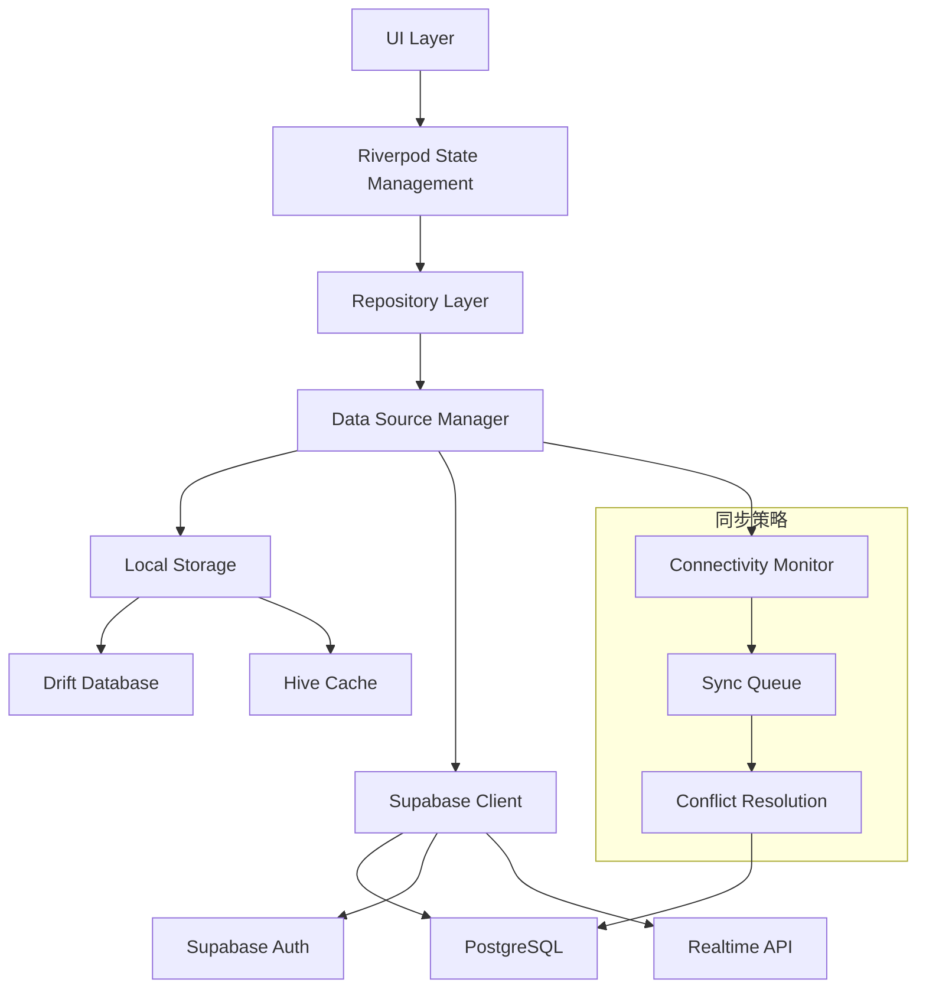
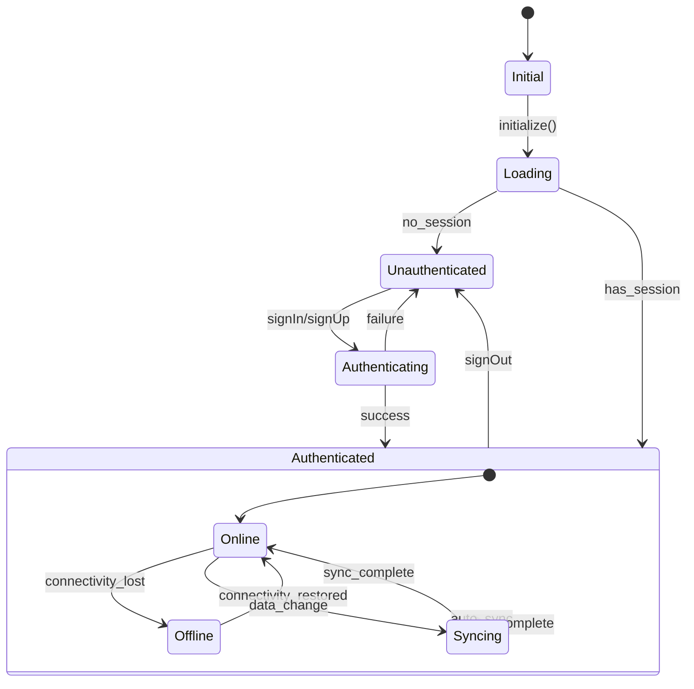
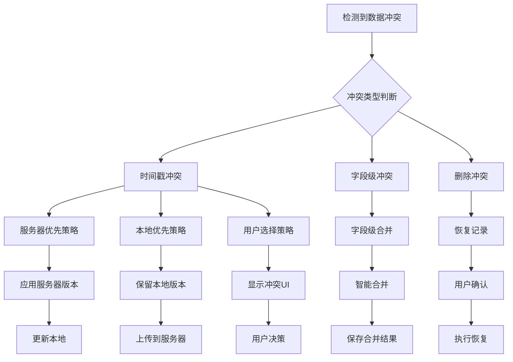
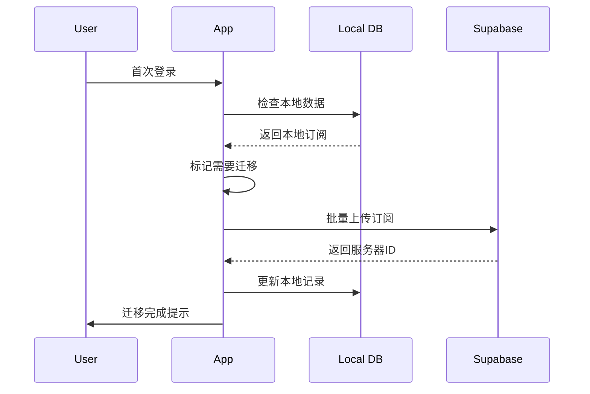

# 账户和数据同步功能设计

## 概述

本设计文档描述了为订阅管理器应用（Flutter）集成账户管理和数据同步功能，采用Supabase作为后端服务。该功能将现有本地数据存储(Drift + Hive)扩展为混合架构，支持用户账户管理、跨设备数据同步以及离线优先的使用体验。

### 核心目标
- 无缝账户管理（注册/登录/登出）
- 跨设备数据同步
- 离线优先体验
- 数据一致性保障
- 迁移现有用户数据

## 技术栈

### 新增依赖
```yaml
dependencies:
  supabase_flutter: ^2.0.0
  connectivity_plus: ^5.0.0
  internet_connection_checker: ^1.0.0
```

### Supabase服务配置
- **数据库**: PostgreSQL (订阅、历史记录、用户配置)
- **认证**: 邮箱/密码、OAuth providers
- **实时同步**: Realtime subscriptions
- **存储**: 文件上传(头像等)

## 架构设计

### 数据流架构



### 账户状态管理



## 数据模型设计

### 用户配置表 (Supabase)

```sql
-- profiles表
create table profiles (
  id uuid references auth.users primary key,
  created_at timestamp with time zone default now(),
  updated_at timestamp with time zone default now(),
  display_name text,
  avatar_url text,
  base_currency text default 'CNY',
  theme_mode text default 'system',
  font_size float default 14.0,
  theme_color text,
  sync_enabled boolean default true
);
```

### 订阅表 (Supabase)

```sql
-- subscriptions表
create table subscriptions (
  id uuid default gen_random_uuid() primary key,
  user_id uuid references auth.users not null,
  name text not null,
  price decimal(10,2) not null,
  currency text not null,
  billing_cycle text not null,
  next_payment_date date not null,
  description text,
  icon_name text,
  color text,
  is_active boolean default true,
  created_at timestamp with time zone default now(),
  updated_at timestamp with time zone default now(),
  local_id text, -- 用于本地数据迁移
  last_synced_at timestamp with time zone
);
```

### 扩展本地数据模型

```dart
// 扩展Subscription模型
@freezed
class Subscription with _$Subscription {
  const factory Subscription({
    required String id,
    required String name,
    required double price,
    required String currency,
    required String billingCycle,
    required DateTime nextPaymentDate,
    String? description,
    String? iconName,
    String? color,
    @Default(true) bool isActive,
    DateTime? createdAt,
    DateTime? updatedAt,
    // 新增同步相关字段
    String? serverId,
    DateTime? lastSyncedAt,
    @Default(false) bool needsSync,
    @Default(SyncStatus.synced) SyncStatus syncStatus,
  }) = _Subscription;
}

enum SyncStatus { 
  synced,     // 已同步
  pending,    // 待上传
  conflict,   // 有冲突
  error       // 同步失败
}
```

## 核心服务实现

### 认证服务

```dart
@riverpod
class AuthService extends _$AuthService {
  @override
  AsyncValue<User?> build() {
    return const AsyncLoading();
  }

  Future<void> signUp({
    required String email,
    required String password,
    String? displayName,
  }) async {
    state = const AsyncLoading();
    try {
      final response = await Supabase.instance.client.auth.signUp(
        email: email,
        password: password,
        data: {'display_name': displayName},
      );
      
      if (response.user != null) {
        await _createUserProfile(response.user!);
        state = AsyncData(response.user);
      }
    } catch (e) {
      state = AsyncError(e, StackTrace.current);
    }
  }

  Future<void> signIn({
    required String email,
    required String password,
  }) async {
    state = const AsyncLoading();
    try {
      final response = await Supabase.instance.client.auth.signInWithPassword(
        email: email,
        password: password,
      );
      
      if (response.user != null) {
        state = AsyncData(response.user);
        // 触发数据同步
        ref.read(syncServiceProvider.notifier).syncAfterAuth();
      }
    } catch (e) {
      state = AsyncError(e, StackTrace.current);
    }
  }

  Future<void> signOut() async {
    await Supabase.instance.client.auth.signOut();
    state = const AsyncData(null);
    // 清理本地同步状态
    ref.read(syncServiceProvider.notifier).clearSyncState();
  }
}
```

### 数据同步服务

```dart
@riverpod
class SyncService extends _$SyncService {
  @override
  SyncState build() {
    return const SyncState();
  }

  Future<void> syncAfterAuth() async {
    final user = ref.read(authServiceProvider).value;
    if (user == null) return;

    state = state.copyWith(isLoading: true);
    
    try {
      // 1. 上传本地未同步数据
      await _uploadLocalData();
      
      // 2. 下载服务器数据
      await _downloadServerData();
      
      // 3. 解决冲突
      await _resolveConflicts();
      
      // 4. 启动实时监听
      _setupRealtimeSubscription();
      
      state = state.copyWith(
        isLoading: false,
        lastSyncTime: DateTime.now(),
      );
    } catch (e) {
      state = state.copyWith(
        isLoading: false,
        error: e.toString(),
      );
    }
  }

  Future<void> _uploadLocalData() async {
    final localSubscriptions = await ref
        .read(subscriptionRepositoryProvider)
        .getUnsyncedSubscriptions();
    
    for (final subscription in localSubscriptions) {
      try {
        if (subscription.serverId == null) {
          // 新建记录
          await _createSubscriptionOnServer(subscription);
        } else {
          // 更新记录
          await _updateSubscriptionOnServer(subscription);
        }
      } catch (e) {
        // 标记同步失败
        await _markSyncError(subscription, e);
      }
    }
  }

  Future<void> _downloadServerData() async {
    final serverSubscriptions = await Supabase.instance.client
        .from('subscriptions')
        .select()
        .eq('user_id', ref.read(authServiceProvider).value!.id);
    
    for (final data in serverSubscriptions) {
      final subscription = Subscription.fromJson(data);
      await ref.read(subscriptionRepositoryProvider)
          .saveFromServer(subscription);
    }
  }

  void _setupRealtimeSubscription() {
    final userId = ref.read(authServiceProvider).value?.id;
    if (userId == null) return;

    Supabase.instance.client
        .channel('subscriptions')
        .onPostgresChanges(
          event: PostgresChangeEvent.all,
          schema: 'public',
          table: 'subscriptions',
          filter: PostgresChangeFilter(
            type: PostgresChangeFilterType.eq,
            column: 'user_id',
            value: userId,
          ),
          callback: _handleRealtimeChange,
        )
        .subscribe();
  }

  void _handleRealtimeChange(PostgresChangePayload payload) {
    switch (payload.eventType) {
      case PostgresChangeEvent.insert:
        _handleInsert(payload);
        break;
      case PostgresChangeEvent.update:
        _handleUpdate(payload);
        break;
      case PostgresChangeEvent.delete:
        _handleDelete(payload);
        break;
    }
  }
}
```

### 连接状态监控

```dart
@riverpod
class ConnectivityService extends _$ConnectivityService {
  late StreamSubscription<ConnectivityResult> _subscription;

  @override
  bool build() {
    _subscription = Connectivity().onConnectivityChanged.listen((result) {
      final isOnline = result != ConnectivityResult.none;
      state = isOnline;
      
      if (isOnline) {
        // 网络恢复时触发同步
        ref.read(syncServiceProvider.notifier).syncOnReconnect();
      }
    });
    
    return true; // 默认在线
  }

  void dispose() {
    _subscription.cancel();
  }
}
```

## Repository层改造

### 混合Repository实现

```dart
class HybridSubscriptionRepository implements SubscriptionRepository {
  final LocalSubscriptionRepository _localRepo;
  final RemoteSubscriptionRepository _remoteRepo;
  final ConnectivityService _connectivity;

  HybridSubscriptionRepository(
    this._localRepo,
    this._remoteRepo,
    this._connectivity,
  );

  @override
  Future<List<Subscription>> getAllSubscriptions() async {
    // 优先返回本地数据
    final local = await _localRepo.getAllSubscriptions();
    
    if (_connectivity.isOnline) {
      // 后台同步
      _syncInBackground();
    }
    
    return local;
  }

  @override
  Future<void> addSubscription(Subscription subscription) async {
    // 立即保存到本地
    await _localRepo.addSubscription(subscription.copyWith(
      needsSync: true,
      syncStatus: SyncStatus.pending,
    ));
    
    // 尝试上传到服务器
    if (_connectivity.isOnline) {
      try {
        await _remoteRepo.addSubscription(subscription);
        await _localRepo.updateSyncStatus(subscription.id, SyncStatus.synced);
      } catch (e) {
        await _localRepo.updateSyncStatus(subscription.id, SyncStatus.error);
      }
    }
  }

  Future<void> _syncInBackground() async {
    // 实现后台同步逻辑
  }
}
```

## 冲突解决策略

### 冲突检测与解决



### 冲突解决实现

```dart
class ConflictResolver {
  Future<Subscription> resolveConflict({
    required Subscription local,
    required Subscription remote,
    ConflictStrategy strategy = ConflictStrategy.lastModified,
  }) async {
    switch (strategy) {
      case ConflictStrategy.lastModified:
        return _resolveByTimestamp(local, remote);
      case ConflictStrategy.serverWins:
        return remote;
      case ConflictStrategy.clientWins:
        return local;
      case ConflictStrategy.userChoice:
        return await _showConflictDialog(local, remote);
      case ConflictStrategy.merge:
        return _mergeSubscriptions(local, remote);
    }
  }

  Subscription _resolveByTimestamp(
    Subscription local,
    Subscription remote,
  ) {
    final localTime = local.updatedAt ?? local.createdAt ?? DateTime.now();
    final remoteTime = remote.updatedAt ?? remote.createdAt ?? DateTime.now();
    
    return localTime.isAfter(remoteTime) ? local : remote;
  }

  Subscription _mergeSubscriptions(
    Subscription local,
    Subscription remote,
  ) {
    // 智能合并逻辑
    return local.copyWith(
      // 保留本地的用户偏好设置
      name: local.name.isNotEmpty ? local.name : remote.name,
      description: local.description?.isNotEmpty == true 
          ? local.description 
          : remote.description,
      // 保留最新的财务数据
      price: remote.price,
      nextPaymentDate: remote.nextPaymentDate,
      updatedAt: DateTime.now(),
    );
  }
}
```

## UI层集成

### 认证页面

```dart
class AuthScreen extends ConsumerWidget {
  @override
  Widget build(BuildContext context, WidgetRef ref) {
    final authState = ref.watch(authServiceProvider);
    
    return Scaffold(
      appBar: AppBar(title: Text('账户登录')),
      body: authState.when(
        loading: () => const Center(child: CircularProgressIndicator()),
        error: (error, _) => ErrorWidget(error),
        data: (user) => user != null 
            ? const SyncIndicator()
            : const AuthForm(),
      ),
    );
  }
}

class AuthForm extends ConsumerStatefulWidget {
  @override
  ConsumerState<AuthForm> createState() => _AuthFormState();
}

class _AuthFormState extends ConsumerState<AuthForm> {
  final _emailController = TextEditingController();
  final _passwordController = TextEditingController();
  bool _isSignUp = false;

  @override
  Widget build(BuildContext context) {
    return Padding(
      padding: const EdgeInsets.all(16),
      child: Column(
        children: [
          TextField(
            controller: _emailController,
            decoration: const InputDecoration(labelText: '邮箱'),
            keyboardType: TextInputType.emailAddress,
          ),
          const SizedBox(height: 16),
          TextField(
            controller: _passwordController,
            decoration: const InputDecoration(labelText: '密码'),
            obscureText: true,
          ),
          const SizedBox(height: 24),
          ElevatedButton(
            onPressed: _submit,
            child: Text(_isSignUp ? '注册' : '登录'),
          ),
          TextButton(
            onPressed: () => setState(() => _isSignUp = !_isSignUp),
            child: Text(_isSignUp ? '已有账户？登录' : '没有账户？注册'),
          ),
        ],
      ),
    );
  }

  void _submit() {
    final email = _emailController.text.trim();
    final password = _passwordController.text;
    
    if (_isSignUp) {
      ref.read(authServiceProvider.notifier).signUp(
        email: email,
        password: password,
      );
    } else {
      ref.read(authServiceProvider.notifier).signIn(
        email: email,
        password: password,
      );
    }
  }
}
```

### 同步状态指示器

```dart
class SyncIndicator extends ConsumerWidget {
  @override
  Widget build(BuildContext context, WidgetRef ref) {
    final syncState = ref.watch(syncServiceProvider);
    final isOnline = ref.watch(connectivityServiceProvider);
    
    return Container(
      padding: const EdgeInsets.symmetric(horizontal: 16, vertical: 8),
      color: _getStatusColor(syncState, isOnline),
      child: Row(
        children: [
          Icon(_getStatusIcon(syncState, isOnline)),
          const SizedBox(width: 8),
          Text(_getStatusText(syncState, isOnline)),
          if (syncState.isLoading) ...[
            const Spacer(),
            const SizedBox(
              width: 16,
              height: 16,
              child: CircularProgressIndicator(strokeWidth: 2),
            ),
          ],
        ],
      ),
    );
  }

  Color _getStatusColor(SyncState state, bool isOnline) {
    if (!isOnline) return Colors.orange.shade100;
    if (state.error != null) return Colors.red.shade100;
    if (state.isLoading) return Colors.blue.shade100;
    return Colors.green.shade100;
  }

  IconData _getStatusIcon(SyncState state, bool isOnline) {
    if (!isOnline) return Icons.cloud_off;
    if (state.error != null) return Icons.error;
    if (state.isLoading) return Icons.sync;
    return Icons.cloud_done;
  }

  String _getStatusText(SyncState state, bool isOnline) {
    if (!isOnline) return '离线模式';
    if (state.error != null) return '同步失败';
    if (state.isLoading) return '同步中...';
    if (state.lastSyncTime != null) {
      return '已同步 ${_formatTime(state.lastSyncTime!)}';
    }
    return '已同步';
  }
}
```

## 数据迁移策略

### 本地到云端迁移



### 迁移服务实现

```dart
class MigrationService {
  final LocalSubscriptionRepository _localRepo;
  final RemoteSubscriptionRepository _remoteRepo;

  MigrationService(this._localRepo, this._remoteRepo);

  Future<MigrationResult> migrateUserData(String userId) async {
    final result = MigrationResult();
    
    try {
      // 1. 获取所有本地数据
      final localSubscriptions = await _localRepo.getAllSubscriptions();
      final unmigrated = localSubscriptions.where((s) => s.serverId == null);
      
      result.totalCount = unmigrated.length;
      
      // 2. 批量上传
      for (final subscription in unmigrated) {
        try {
          final serverSubscription = await _remoteRepo.createSubscription(
            subscription.copyWith(userId: userId),
          );
          
          // 更新本地记录
          await _localRepo.updateSubscription(subscription.copyWith(
            serverId: serverSubscription.id,
            syncStatus: SyncStatus.synced,
            lastSyncedAt: DateTime.now(),
          ));
          
          result.successCount++;
        } catch (e) {
          result.failures.add(MigrationFailure(
            subscription: subscription,
            error: e.toString(),
          ));
        }
      }
      
      // 3. 同步用户配置
      await _migrateUserPreferences(userId);
      
    } catch (e) {
      result.error = e.toString();
    }
    
    return result;
  }

  Future<void> _migrateUserPreferences(String userId) async {
    final preferences = await UserPreferences.getInstance();
    
    await Supabase.instance.client.from('profiles').upsert({
      'id': userId,
      'base_currency': await preferences.getBaseCurrency(),
      'theme_mode': 'system', // 默认值
      'font_size': 14.0,
      'sync_enabled': true,
    });
  }
}
```

## 安全与性能考虑

### 数据安全
- **Row Level Security (RLS)**: 确保用户只能访问自己的数据
- **数据加密**: 敏感信息在传输和存储时加密
- **访问控制**: 基于JWT的身份验证

### 性能优化
- **增量同步**: 只同步变更的数据
- **压缩上传**: 批量操作减少网络请求
- **缓存策略**: 智能本地缓存减少服务器负载
- **离线队列**: 网络恢复时自动执行待同步操作

### 错误处理
- **重试机制**: 网络异常时自动重试
- **错误分类**: 区分网络错误、认证错误、数据冲突
- **用户反馈**: 清晰的错误提示和解决建议

## 部署配置

### Supabase项目设置

1. **数据库Schema部署**
```sql
-- 启用RLS
alter table subscriptions enable row level security;
alter table profiles enable row level security;

-- 创建策略
create policy "Users can view own subscriptions" on subscriptions
  for select using (auth.uid() = user_id);

create policy "Users can insert own subscriptions" on subscriptions
  for insert with check (auth.uid() = user_id);

create policy "Users can update own subscriptions" on subscriptions
  for update using (auth.uid() = user_id);

-- 启用实时功能
alter publication supabase_realtime add table subscriptions;
alter publication supabase_realtime add table profiles;
```

2. **环境配置**
```dart
// lib/config/supabase_config.dart
class SupabaseConfig {
  static const String url = String.fromEnvironment(
    'SUPABASE_URL',
    defaultValue: 'https://your-project.supabase.co',
  );
  
  static const String anonKey = String.fromEnvironment(
    'SUPABASE_ANON_KEY',
    defaultValue: 'your-anon-key',
  );
}
```

3. **初始化配置**
```dart
// main.dart
Future<void> main() async {
  WidgetsFlutterBinding.ensureInitialized();
  
  await Supabase.initialize(
    url: SupabaseConfig.url,
    anonKey: SupabaseConfig.anonKey,
    authFlowType: AuthFlowType.pkce,
  );
  
  // 其他初始化代码...
  
  runApp(const MyApp());
}
```
