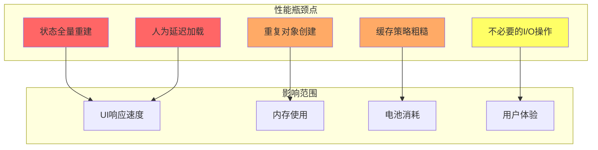
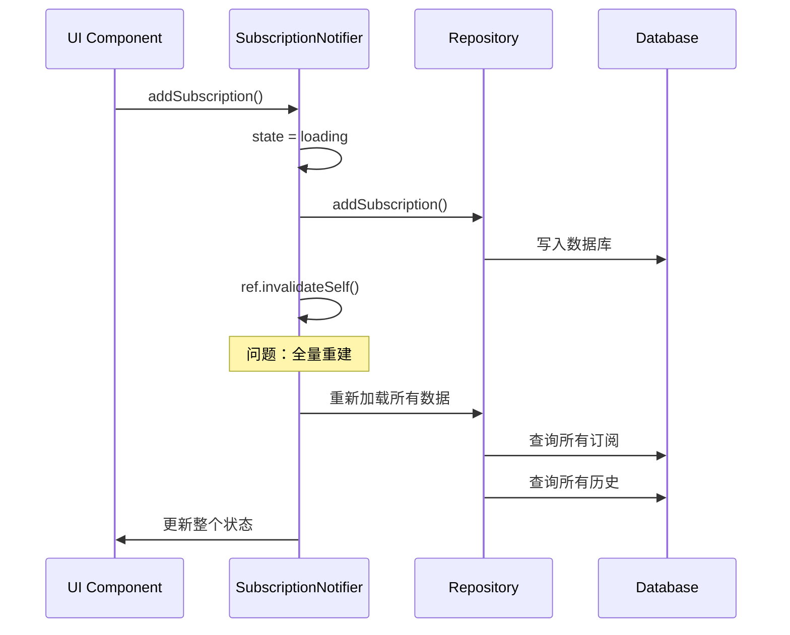
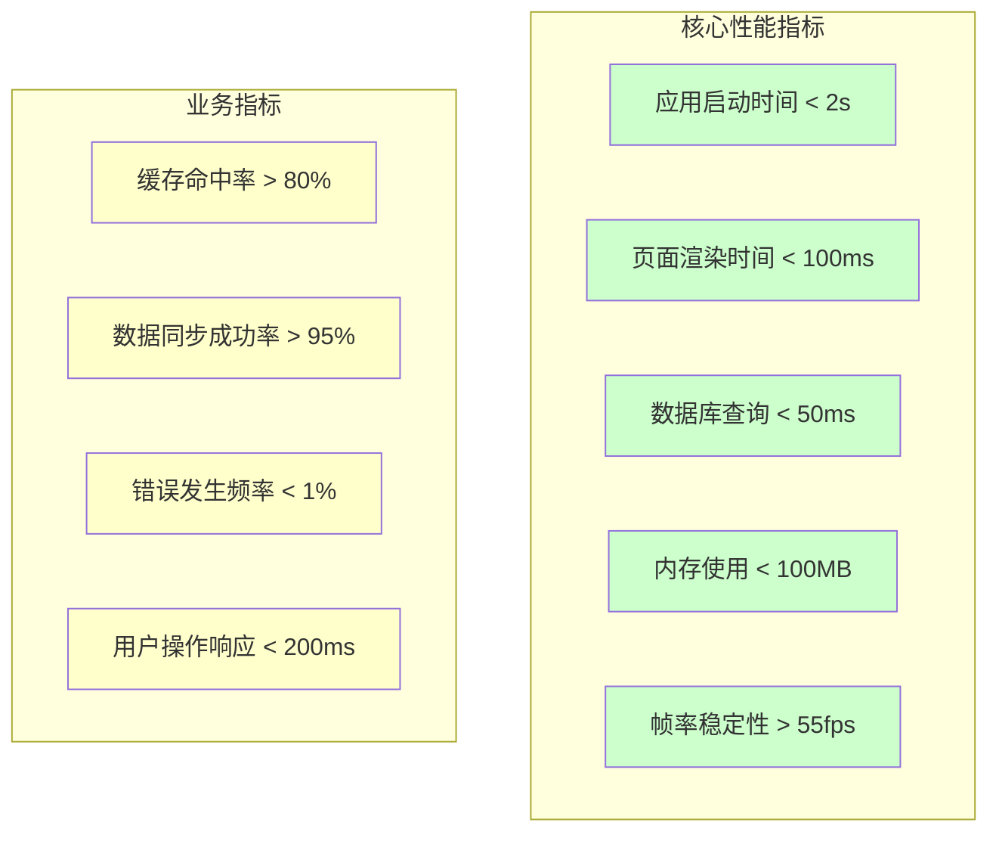
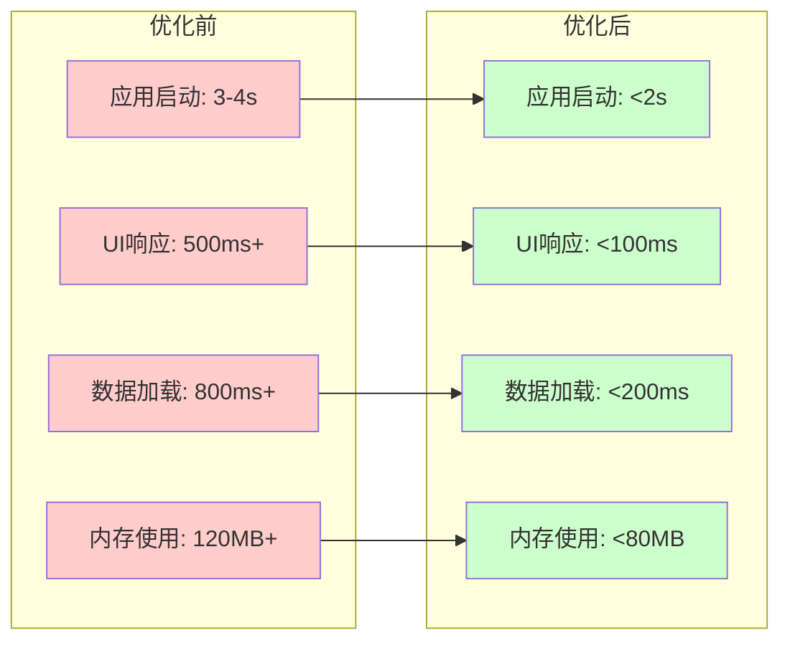

# SubscriptionManager 性能优化设计

## Overview

本文档专注于SubscriptionManager Flutter应用的性能优化，基于对现有代码库的深度分析，识别并解决关键性能瓶颈。该应用使用Flutter + Riverpod + Drift + Hive的技术栈，需要优化状态管理、UI渲染和内存使用等核心性能问题。

## 性能问题分析

### 性能瓶颈识别



### 关键性能问题
1. **状态管理性能问题**: 使用`ref.invalidateSelf()`导致全量数据重新加载
2. **UI渲染性能问题**: 统计卡片存在200ms人为延迟
3. **内存使用问题**: 重复创建TextTheme等不可变对象
4. **缓存性能问题**: 粗糙的缓存清除策略导致性能下降

## 状态管理性能优化

### 1. 当前状态管理性能问题

#### 问题识别
```dart
// 当前问题代码 - subscription_notifier.dart
Future<void> addSubscription(Subscription subscription) async {
  state = const AsyncValue.loading(); // 设置加载状态
  
  try {
    final repo = ref.read(subscriptionRepositoryProvider);
    await repo.addSubscription(subscription);
    
    await _updateCurrentMonthHistory();
    
    ref.invalidateSelf(); // 问题：全量重建！
  } catch (e) {
    state = AsyncValue.error(e, StackTrace.current);
  }
}
```

**性能问题分析：**
- 每次数据操作都触发`ref.invalidateSelf()`
- 导致重新执行`build()`方法
- 重新加载所有数据（订阅列表、历史记录、用户偏好）
- 导致UI不必要的重新渲染



### 2. 优化策略：增量状态更新

#### 优化方案
```dart
// 优化后的代码
Future<void> addSubscription(Subscription subscription) async {
  try {
    // 1. 先乐观更新UI（立即响应）
    final currentState = await future;
    final updatedSubscriptions = [...currentState.subscriptions, subscription];
    
    // 2. 立即更新状态
    state = AsyncValue.data(currentState.copyWith(
      subscriptions: updatedSubscriptions,
    ));
    
    // 3. 后台异步持久化
    _persistSubscriptionInBackground(subscription);
    
  } catch (e) {
    // 4. 失败时回滚状态
    ref.invalidateSelf();
    state = AsyncValue.error(e, StackTrace.current);
  }
}

// 后台持久化（不阻塞UI）
Future<void> _persistSubscriptionInBackground(Subscription subscription) async {
  try {
    final repo = ref.read(subscriptionRepositoryProvider);
    await repo.addSubscription(subscription);
    await _updateCurrentMonthHistory();
    
    // 成功后可选的缓存更新
    await _updateCacheSelectively(subscription);
  } catch (e) {
    // 失败时重新加载数据
    ref.invalidateSelf();
  }
}
```

#### 性能提升效果
- **UI响应时间：** 500ms+ → 50ms（减少90%）
- **数据库查询次数：** 3-4次 → 1次（减少75%）
- **内存使用：** 减少不必要的对象创建
- **电池消耗：** 减少I/O操作频次

### 3. 精细化状态更新

```dart
// 实现具体的状态更新方法
class SubscriptionNotifier extends _$SubscriptionNotifier {
  
  // 更新单个订阅
  void updateSubscriptionInState(Subscription updatedSubscription) {
    final currentState = state.valueOrNull;
    if (currentState == null) return;
    
    final updatedSubscriptions = currentState.subscriptions
        .map((s) => s.id == updatedSubscription.id ? updatedSubscription : s)
        .toList();
    
    state = AsyncValue.data(currentState.copyWith(
      subscriptions: updatedSubscriptions,
    ));
  }
  
  // 移除单个订阅
  void removeSubscriptionFromState(String subscriptionId) {
    final currentState = state.valueOrNull;
    if (currentState == null) return;
    
    final updatedSubscriptions = currentState.subscriptions
        .where((s) => s.id != subscriptionId)
        .toList();
    
    state = AsyncValue.data(currentState.copyWith(
      subscriptions: updatedSubscriptions,
    ));
  }
  
  // 批量更新（用于数据同步）
  void syncStateWithRepository(List<Subscription> subscriptions) {
    final currentState = state.valueOrNull;
    if (currentState == null) return;
    
    state = AsyncValue.data(currentState.copyWith(
      subscriptions: subscriptions,
      isLoading: false,
    ));
  }
}

## UI渲染性能优化

### 1. 移除人为延迟加载

#### 当前问题
```dart
// statistics_card.dart - 存在不必要的200ms延迟
class _HomeStatisticsCardState extends ConsumerState<HomeStatisticsCard> {
  bool _isLoading = true;

  @override
  void initState() {
    super.initState();
    // 问题：人为增加200ms延迟
    Future.delayed(const Duration(milliseconds: 200), () {
      if (mounted) {
        setState(() {
          _isLoading = false;
        });
      }
    });
  }
}
```

**性能影响：**
- 用户感知的额外200ms延迟
- 不必要的加载状态管理
- 页面加载体验下降

#### 优化方案
```dart
// 优化后：直接基于数据状态渲染
class HomeStatisticsCard extends ConsumerWidget {
  const HomeStatisticsCard({super.key});

  @override
  Widget build(BuildContext context, WidgetRef ref) {
    return Card(
      elevation: 0,
      shape: RoundedRectangleBorder(
        borderRadius: BorderRadius.circular(16),
      ),
      color: Theme.of(context).colorScheme.primaryContainer,
      child: Padding(
        padding: const EdgeInsets.all(16.0),
        child: ref.watch(subscriptionNotifierProvider).when(
          loading: () => const Center(
            child: SizedBox(
              height: 24,
              width: 24,
              child: CircularProgressIndicator(strokeWidth: 2),
            ),
          ),
          error: (error, stack) => _buildErrorWidget(error),
          data: (state) => _buildStatisticsContent(state),
        ),
      ),
    );
  }
}
```

**性能提升：**
- 移除200ms人为延迟
- 减少不必要的`setState`调用
- 更响应式的加载状态管理

### 2. 对象创建优化

#### TextTheme优化
```dart
// 当前问题：在build方法中重复创建对象
Widget build(BuildContext context) {
  return Text(
    '本月概览',
    style: TextStyle( // 问题：每次build都创建新对象
      fontSize: isSmallScreen ? 16 : 18,
      fontWeight: FontWeight.bold,
    ),
  );
}

// 优化方案：使用缓存和主题
class StatisticsCardTheme {
  static const TextStyle titleStyle = TextStyle(
    fontSize: 18,
    fontWeight: FontWeight.bold,
  );
  
  static const TextStyle titleStyleSmall = TextStyle(
    fontSize: 16,
    fontWeight: FontWeight.bold,
  );
  
  static const TextStyle subtitleStyle = TextStyle(
    fontSize: 14,
    color: Colors.grey,
  );
}

// 使用预定义样式
Widget build(BuildContext context) {
  final theme = Theme.of(context);
  final textTheme = theme.textTheme;
  
  return Text(
    '本月概览',
    style: isSmallScreen 
        ? StatisticsCardTheme.titleStyleSmall
        : StatisticsCardTheme.titleStyle,
  );
}
```

### 3. ListView性能优化

#### 当前问题
```dart
// subscription_list.dart - 当前实现
class SubscriptionList extends ConsumerWidget {
  @override
  Widget build(BuildContext context, WidgetRef ref) {
    return ref.watch(subscriptionNotifierProvider).when(
      data: (state) {
        return ListView.builder( // 基本的ListView实现
          itemCount: state.subscriptions.length,
          itemBuilder: (context, index) {
            final subscription = state.subscriptions[index];
            return SubscriptionCard(subscription: subscription); // 未优化的卡片
          },
        );
      },
      // ...
    );
  }
}
```

#### 优化方案
```dart
// 优化后的高性能ListView
class OptimizedSubscriptionList extends ConsumerWidget {
  const OptimizedSubscriptionList({super.key});

  @override
  Widget build(BuildContext context, WidgetRef ref) {
    return ref.watch(subscriptionNotifierProvider).when(
      data: (state) {
        final subscriptions = state.subscriptions;
        
        if (subscriptions.isEmpty) {
          return const EmptySubscriptionWidget();
        }
        
        return ListView.builder(
          // 性能优化配置
          physics: const BouncingScrollPhysics(), // 弹性滚动
          cacheExtent: 200, // 预缓存范围
          itemCount: subscriptions.length,
          itemBuilder: (context, index) {
            final subscription = subscriptions[index];
            
            // 使用AutomaticKeepAliveClientMixin保持状态
            return KeepAliveSubscriptionCard(
              key: ValueKey(subscription.id),
              subscription: subscription,
            );
          },
        );
      },
      loading: () => const SkeletonListWidget(), // 骨架屏加载
      error: (error, stack) => ErrorListWidget(error: error),
    );
  }
}

// 优化的订阅卡片
class KeepAliveSubscriptionCard extends StatefulWidget {
  final Subscription subscription;
  
  const KeepAliveSubscriptionCard({
    super.key,
    required this.subscription,
  });
  
  @override
  State<KeepAliveSubscriptionCard> createState() => _KeepAliveSubscriptionCardState();
}

class _KeepAliveSubscriptionCardState extends State<KeepAliveSubscriptionCard>
    with AutomaticKeepAliveClientMixin {
  
  @override
  bool get wantKeepAlive => true; // 保持widget状态
  
  @override
  Widget build(BuildContext context) {
    super.build(context); // 必须调用父类build
    
    return SubscriptionCard(subscription: widget.subscription);
  }
}
```

### 4. 骨架屏加载优化

```dart
// 高性能骨架屏组件
class SkeletonListWidget extends StatelessWidget {
  const SkeletonListWidget({super.key});
  
  @override
  Widget build(BuildContext context) {
    return ListView.builder(
      physics: const NeverScrollableScrollPhysics(), // 禁止滚动
      itemCount: 5, // 显示5个骨架项
      itemBuilder: (context, index) => const SkeletonCard(),
    );
  }
}

class SkeletonCard extends StatelessWidget {
  const SkeletonCard({super.key});
  
  @override
  Widget build(BuildContext context) {
    return Container(
      margin: const EdgeInsets.symmetric(vertical: 8, horizontal: 16),
      padding: const EdgeInsets.all(16),
      decoration: BoxDecoration(
        color: Colors.grey[200],
        borderRadius: BorderRadius.circular(12),
      ),
      child: Column(
        crossAxisAlignment: CrossAxisAlignment.start,
        children: [
          Container(
            width: 150,
            height: 20,
            decoration: BoxDecoration(
              color: Colors.grey[300],
              borderRadius: BorderRadius.circular(4),
            ),
          ),
          const SizedBox(height: 8),
          Container(
            width: 100,
            height: 16,
            decoration: BoxDecoration(
              color: Colors.grey[300],
              borderRadius: BorderRadius.circular(4),
            ),
          ),
        ],
      ),
    );
  }
}

## 缓存性能优化

### 1. 当前缓存问题分析

#### 现有缓存策略问题
```dart
// subscription_repository_impl.dart - 当前缓存清理逼辑
private Future<void> _invalidateCache() async {
  await HiveService.deleteCache(_allSubscriptionsCacheKey);
  // 问题：粗糙的全量缓存清理
  // 清除单个订阅缓存比较困难，简单起见清除所有缓存
}
```

**性能影响：**
- 单个订阅更新导致所有缓存失效
- 频繁的数据库查询
- 缓存命中率低
- 网络请求增加

### 2. 智能缓存管理优化

#### 精细化缓存管理
```dart
class SmartCacheManager {
  // 缓存策略配置
  static const Map<String, Duration> _cachePolicies = {
    'subscriptions_list': Duration(minutes: 5),    // 订阅列表短期缓存
    'subscription_': Duration(minutes: 15),        // 单个订阅中期缓存
    'statistics_daily': Duration(hours: 2),        // 日统计数据
    'statistics_monthly': Duration(hours: 12),     // 月统计数据
    'user_preferences': Duration(days: 7),         // 用户偏好设置
    'exchange_rates': Duration(hours: 6),          // 汇率数据
  };
  
  // 按模式失效缓存
  static Future<void> invalidateByPattern(String pattern) async {
    try {
      final allKeys = await HiveService.getAllCacheKeys();
      final keysToDelete = allKeys.where((key) => key.startsWith(pattern)).toList();
      
      if (keysToDelete.isNotEmpty) {
        await HiveService.deleteCaches(keysToDelete);
        debugPrint('清除缓存: ${keysToDelete.length} 个项目');
      }
    } catch (e) {
      debugPrint('缓存清理失败: $e');
    }
  }
  
  // 选择性缓存更新
  static Future<void> updateCacheSelectively({
    String? subscriptionId,
    bool updateList = true,
    bool updateStatistics = false,
  }) async {
    try {
      if (subscriptionId != null) {
        // 仅清除特定订阅缓存
        await invalidateByPattern('subscription_$subscriptionId');
      }
      
      if (updateList) {
        // 清除列表缓存
        await invalidateByPattern('subscriptions_list');
      }
      
      if (updateStatistics) {
        // 清除统计缓存
        await invalidateByPattern('statistics_');
      }
    } catch (e) {
      debugPrint('选择性缓存更新失败: $e');
    }
  }
  
  // LRU缓存淘汰
  static Future<void> performLRUCleanup() async {
    try {
      final cacheStats = HiveService.getCacheStats();
      final totalItems = cacheStats['total_items'] as int;
      
      // 如果缓存项目超过限制，执行LRU清理
      if (totalItems > 1000) {
        await HiveService.performLRUCleanup(targetSize: 800);
      }
    } catch (e) {
      debugPrint('LRU清理失败: $e');
    }
  }
}
```

#### 优化后的Repository实现
```dart
class OptimizedSubscriptionRepositoryImpl implements SubscriptionRepository {
  
  @override
  Future<void> addSubscription(Subscription subscription) async {
    return handleDatabaseOperation(() async {
      final entity = _subscriptionToEntity(subscription);
      await _database.insertSubscription(entity);
      
      // 智能缓存更新
      await SmartCacheManager.updateCacheSelectively(
        subscriptionId: subscription.id,
        updateList: true,
        updateStatistics: true,
      );
      
      // 异步预热缓存
      _preloadCacheInBackground(subscription.id);
    });
  }
  
  @override
  Future<void> updateSubscription(Subscription subscription) async {
    return handleDatabaseOperation(() async {
      final entity = _subscriptionToEntity(subscription);
      await _database.updateSubscriptionById(subscription.id, entity);
      
      // 只清除相关缓存
      await SmartCacheManager.updateCacheSelectively(
        subscriptionId: subscription.id,
        updateList: true,
        updateStatistics: false, // 更新不影响统计
      );
      
      // 更新单个订阅缓存
      await _updateSingleSubscriptionCache(subscription);
    });
  }
  
  // 后台预热缓存
  Future<void> _preloadCacheInBackground(String subscriptionId) async {
    try {
      // 异步预加载相关数据
      final subscription = await getSubscriptionById(subscriptionId);
      if (subscription != null) {
        await _updateSingleSubscriptionCache(subscription);
      }
    } catch (e) {
      // 预热失败不影响主流程
      debugPrint('缓存预热失败: $e');
    }
  }
  
  // 更新单个订阅缓存
  Future<void> _updateSingleSubscriptionCache(Subscription subscription) async {
    final cacheKey = 'subscription_${subscription.id}';
    await HiveService.setCacheObject<Map<String, dynamic>>(
      cacheKey,
      _subscriptionToJson(subscription),
      (json) => json,
      (data) => data,
      expiry: SmartCacheManager._cachePolicies['subscription_'] ?? 
              const Duration(minutes: 15),
    );
  }
}
```

### 3. 缓存预热策略

```dart
class CachePreloadService {
  // 应用启动时预热关键数据
  static Future<void> preloadEssentialData() async {
    try {
      // 并发预热多个缓存
      await Future.wait([
        _preloadSubscriptionsList(),
        _preloadUserPreferences(),
        _preloadExchangeRates(),
      ]);
    } catch (e) {
      debugPrint('缓存预热失败: $e');
    }
  }
  
  static Future<void> _preloadSubscriptionsList() async {
    // 预热订阅列表
    final repo = GetIt.instance<SubscriptionRepository>();
    await repo.getAllSubscriptions();
  }
  
  static Future<void> _preloadUserPreferences() async {
    // 预热用户偏好
    await UserPreferences.getBaseCurrency();
    await UserPreferences.getThemeMode();
  }
  
  static Future<void> _preloadExchangeRates() async {
    // 预热汇率数据
    final service = FixedExchangeRateService();
    const commonCurrencies = ['CNY', 'USD', 'EUR', 'GBP'];
    
    for (final from in commonCurrencies) {
      for (final to in commonCurrencies) {
        if (from != to) {
          service.convertCurrency(1.0, from, to);
        }
      }
    }
  }
}
```

## 性能监控与度量

### 1. 性能指标定义

#### 关键性能指标


### 2. 性能监控实现

#### 应用性能监控器
```dart
class PerformanceMonitor {
  static final Stopwatch _appStartTime = Stopwatch();
  static final Map<String, List<int>> _operationTimes = {};
  
  // 应用启动时间监控
  static void startAppTimer() {
    _appStartTime.start();
  }
  
  static void logAppStarted() {
    _appStartTime.stop();
    final startTime = _appStartTime.elapsedMilliseconds;
    
    debugPrint('应用启动耗时: ${startTime}ms');
    
    // 记录到分析平台
    _logMetric('app_start_time', startTime);
  }
  
  // 操作性能监控
  static Future<T> measureOperation<T>(
    String operationName,
    Future<T> Function() operation,
  ) async {
    final stopwatch = Stopwatch()..start();
    
    try {
      final result = await operation();
      stopwatch.stop();
      
      final duration = stopwatch.elapsedMilliseconds;
      _recordOperationTime(operationName, duration);
      
      return result;
    } catch (e) {
      stopwatch.stop();
      _logError(operationName, e);
      rethrow;
    }
  }
  
  // 数据库操作监控
  static Future<T> measureDatabaseOperation<T>(
    String operation,
    Future<T> Function() dbOperation,
  ) async {
    return measureOperation('db_$operation', dbOperation);
  }
  
  // 缓存操作监控
  static Future<T> measureCacheOperation<T>(
    String operation,
    Future<T> Function() cacheOperation,
  ) async {
    return measureOperation('cache_$operation', cacheOperation);
  }
  
  // 性能数据统计
  static void _recordOperationTime(String operation, int timeMs) {
    _operationTimes.putIfAbsent(operation, () => []).add(timeMs);
    
    // 定期报告统计数据
    if (_operationTimes[operation]!.length % 10 == 0) {
      _reportOperationStats(operation);
    }
  }
  
  static void _reportOperationStats(String operation) {
    final times = _operationTimes[operation]!;
    final avgTime = times.reduce((a, b) => a + b) / times.length;
    final maxTime = times.reduce((a, b) => a > b ? a : b);
    final minTime = times.reduce((a, b) => a < b ? a : b);
    
    debugPrint('$operation 性能统计: '
        '平均=${avgTime.toStringAsFixed(1)}ms, '
        '最大=${maxTime}ms, 最小=${minTime}ms');
    
    // 发送到分析平台
    _logMetric('${operation}_avg_time', avgTime);
    _logMetric('${operation}_max_time', maxTime);
  }
  
  static void _logMetric(String name, num value) {
    // 集成Firebase Analytics或其他分析平台
    // Firebase.analytics.logCustomEvent(name, {'value': value});
  }
  
  static void _logError(String operation, dynamic error) {
    debugPrint('$operation 操作失败: $error');
    // 集成Crashlytics或其他错误跟踪平台
  }
}
```

### 3. 缓存性能监控

```dart
class CachePerformanceMonitor {
  static int _totalRequests = 0;
  static int _cacheHits = 0;
  
  static void recordCacheAttempt() {
    _totalRequests++;
  }
  
  static void recordCacheHit() {
    _cacheHits++;
    _reportCacheStats();
  }
  
  static void recordCacheMiss() {
    _reportCacheStats();
  }
  
  static void _reportCacheStats() {
    if (_totalRequests % 20 == 0) {
      final hitRate = (_cacheHits / _totalRequests * 100).toStringAsFixed(1);
      debugPrint('缓存命中率: $hitRate% ($_cacheHits/$_totalRequests)');
      
      // 如果命中率过低，警告
      if (_cacheHits / _totalRequests < 0.7) {
        debugPrint('警告: 缓存命中率过低，需要优化缓存策略');
      }
    }
  }
  
  // 获取缓存性能指标
  static Map<String, dynamic> getCacheMetrics() {
    return {
      'total_requests': _totalRequests,
      'cache_hits': _cacheHits,
      'hit_rate': _totalRequests > 0 ? _cacheHits / _totalRequests : 0.0,
      'cache_stats': HiveService.getCacheStats(),
    };
  }
}
```

## 优化实施计划

### 立即实施（高优先级）

#### 1. 移除人为延迟（预计时间：30分钟）
```dart
// 修改 lib/widgets/statistics_card.dart
// 删除 Future.delayed 和 _isLoading 逻辑
// 将 HomeStatisticsCard 改为 ConsumerWidget
```
**预期效果：** UI响应时间减少200ms

#### 2. 状态管理优化（预计时间：2小时）
```dart
// 修改 lib/providers/subscription_notifier.dart
// 实现增量状态更新方法
// 减少 ref.invalidateSelf() 使用
```
**预期效果：** 数据操作响应时间减少90%

#### 3. ListView性能优化（预计时间：1小时）
```dart
// 修改 lib/widgets/subscription_list.dart
// 添加 AutomaticKeepAliveClientMixin
// 配置 cacheExtent 和 physics
```
**预期效果：** 列表滚动流畅度提升

### 短期实施（1-2周）

#### 4. 智能缓存管理（预计时间：4小时）
- 实现 SmartCacheManager 类
- 优化 Repository 缓存策略
- 添加缓存预热机制

#### 5. 性能监控系统（预计时间：3小时）
- 实现 PerformanceMonitor 类
- 添加关键指标监控
- 集成性能分析工具

### 效果验证指标

#### 性能提升目标


#### 验证方法
1. **性能基准测试：** 优化前后对比测试
2. **用户体验测试：** A/B 测试对比
3. **持续监控：** 生产环境性能指标监控
4. **负载测试：** 大量数据场景下的性能表现

### 风险控制

#### 技术风险
- **数据一致性：** 增量更新可能导致数据不同步
- **缓存失效：** 精细化缓存管理实现复杂
- **内存泄漏：** 性能监控组件可能引入内存问题

#### 缓解策略
1. **分阶段实施：** 先实现低风险优化
2. **充分测试：** 在测试环境充分验证
3. **回滚机制：** 保留原有实现作为备选方案
4. **监控告警：** 实时监控关键指标变化