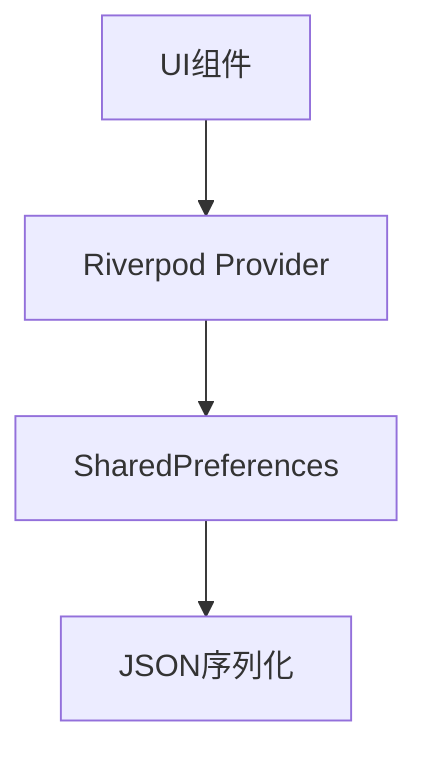
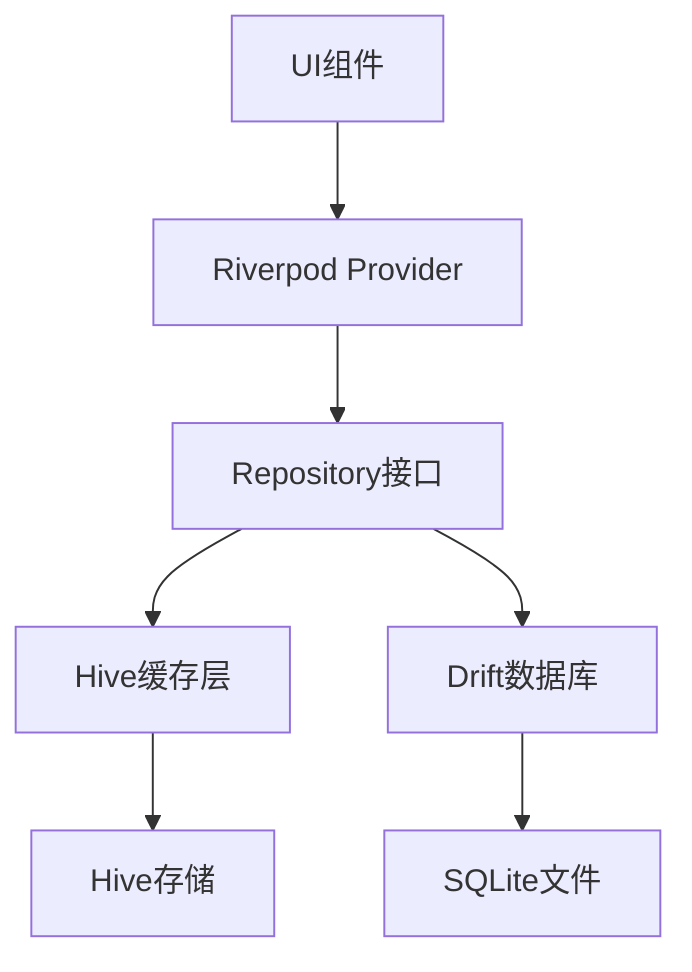

# SubscriptionManager 数据架构升级设计

## 概述

本设计文档描述了将SubscriptionManager项目从当前的SharedPreferences + Riverpod架构升级为Drift + Hive + Repository Pattern的现代化数据架构。这一升级旨在提供更强大的数据管理能力、更好的性能和可维护性。

### 升级目标

- **性能优化**：利用Drift SQL数据库替换SharedPreferences，提供更高效的数据查询和操作
- **数据一致性**：通过Repository Pattern统一数据访问层，确保数据操作的一致性
- **缓存机制**：引入Hive作为高性能缓存层，提升应用响应速度
- **架构现代化**：采用现代Flutter数据架构模式，提升代码可维护性和可测试性

## 技术栈升级

### 新增依赖

```yaml
dependencies:
  # 数据库
  drift: ^2.14.1
  sqlite3_flutter_libs: ^0.5.0
  path_provider: ^2.1.1
  path: ^1.8.3
  
  # 缓存
  hive: ^2.2.3
  hive_flutter: ^1.1.0
  
dev_dependencies:
  # 代码生成
  drift_dev: ^2.14.1
  hive_generator: ^2.0.1
```

### 架构对比

#### 当前架构


#### 目标架构


## 数据库设计

### Drift数据表定义

#### 订阅表 (Subscriptions)

```dart
@DataClassName('SubscriptionEntity')
class Subscriptions extends Table {
  TextColumn get id => text()();
  TextColumn get name => text()();
  TextColumn get icon => text().nullable()();
  TextColumn get type => text()();
  RealColumn get price => real()();
  TextColumn get currency => text().withDefault(const Constant('CNY'))();
  TextColumn get billingCycle => text()();
  DateTimeColumn get nextPaymentDate => dateTime()();
  BoolColumn get autoRenewal => boolean().withDefault(const Constant(false))();
  TextColumn get notes => text().nullable()();
  DateTimeColumn get createdAt => dateTime().withDefault(currentDateAndTime)();
  DateTimeColumn get updatedAt => dateTime().withDefault(currentDateAndTime)();

  @override
  Set<Column> get primaryKey => {id};
}
```

#### 月度历史表 (MonthlyHistories)

```dart
@DataClassName('MonthlyHistoryEntity')
class MonthlyHistories extends Table {
  TextColumn get id => text()();
  IntColumn get year => integer()();
  IntColumn get month => integer()();
  RealColumn get totalAmount => real()();
  TextColumn get currency => text()();
  IntColumn get subscriptionCount => integer()();
  DateTimeColumn get createdAt => dateTime().withDefault(currentDateAndTime)();

  @override
  Set<Column> get primaryKey => {id};
}
```

### 数据库配置

```dart
@DriftDatabase(tables: [Subscriptions, MonthlyHistories])
class AppDatabase extends _$AppDatabase {
  AppDatabase() : super(_openConnection());

  @override
  int get schemaVersion => 1;

  @override
  MigrationStrategy get migration => MigrationStrategy(
    onCreate: (Migrator m) async {
      await m.createAll();
    },
  );
}

LazyDatabase _openConnection() {
  return LazyDatabase(() async {
    final dbFolder = await getApplicationDocumentsDirectory();
    final file = File(join(dbFolder.path, 'subscription_manager.sqlite'));
    return NativeDatabase.createInBackground(file);
  });
}
```

## Hive缓存系统

### 缓存模型定义

```dart
@HiveType(typeId: 0)
class CachedData extends HiveObject {
  @HiveField(0)
  String key;

  @HiveField(1)
  String value;

  @HiveField(2)
  DateTime createdAt;

  @HiveField(3)
  Duration? expiryDuration;

  CachedData({
    required this.key,
    required this.value,
    required this.createdAt,
    this.expiryDuration,
  });

  bool get isExpired {
    if (expiryDuration == null) return false;
    return DateTime.now().isAfter(createdAt.add(expiryDuration!));
  }
}
```

### 缓存服务

```dart
class HiveService {
  static late Box<CachedData> _cacheBox;
  static late Box<String> _userPrefsBox;

  static Future<void> initHive() async {
    await Hive.initFlutter();
    Hive.registerAdapter(CachedDataAdapter());
    
    _cacheBox = await Hive.openBox<CachedData>('cache');
    _userPrefsBox = await Hive.openBox<String>('user_preferences');
  }

  static Future<void> setCache(
    String key, 
    String value, 
    {Duration? expiry}
  ) async {
    final cachedData = CachedData(
      key: key,
      value: value,
      createdAt: DateTime.now(),
      expiryDuration: expiry,
    );
    await _cacheBox.put(key, cachedData);
  }

  static String? getCache(String key) {
    final cached = _cacheBox.get(key);
    if (cached == null || cached.isExpired) {
      return null;
    }
    return cached.value;
  }

  static Future<void> cleanExpiredCache() async {
    final keysToDelete = <String>[];
    for (final cached in _cacheBox.values) {
      if (cached.isExpired) {
        keysToDelete.add(cached.key);
      }
    }
    await _cacheBox.deleteAll(keysToDelete);
  }
}
```

## Repository Pattern实现

### 仓储接口定义

```dart
abstract class SubscriptionRepository {
  Future<List<Subscription>> getAllSubscriptions();
  Future<Subscription?> getSubscriptionById(String id);
  Future<void> addSubscription(Subscription subscription);
  Future<void> updateSubscription(Subscription subscription);
  Future<void> deleteSubscription(String id);
  Future<List<Subscription>> searchSubscriptions(String query);
}

abstract class MonthlyHistoryRepository {
  Future<List<MonthlyHistory>> getAllHistories();
  Future<MonthlyHistory?> getHistoryByYearMonth(int year, int month);
  Future<void> updateCurrentMonthHistory(List<Subscription> subscriptions);
}
```

### 仓储实现

```dart
class SubscriptionRepositoryImpl implements SubscriptionRepository {
  final AppDatabase _database;
  final Box<CachedData> _cacheBox;

  SubscriptionRepositoryImpl(this._database, this._cacheBox);

  @override
  Future<List<Subscription>> getAllSubscriptions() async {
    const cacheKey = 'all_subscriptions';
    
    // 尝试从缓存获取
    final cached = HiveService.getCache(cacheKey);
    if (cached != null) {
      final List<dynamic> cachedData = json.decode(cached);
      return cachedData.map((data) => _entityToSubscription(
        SubscriptionEntity.fromJson(data)
      )).toList();
    }
    
    // 从数据库获取
    final entities = await _database.select(_database.subscriptions).get();
    final subscriptions = entities.map(_entityToSubscription).toList();
    
    // 更新缓存
    await HiveService.setCache(
      cacheKey, 
      json.encode(entities.map((e) => e.toJson()).toList()),
      expiry: const Duration(minutes: 5),
    );
    
    return subscriptions;
  }

  @override
  Future<void> addSubscription(Subscription subscription) async {
    final entity = _subscriptionToEntity(subscription);
    await _database.into(_database.subscriptions).insert(entity);
    await _invalidateCache();
  }

  @override
  Future<void> updateSubscription(Subscription subscription) async {
    final entity = _subscriptionToEntity(subscription);
    await _database.update(_database.subscriptions)
      .replace(entity);
    await _invalidateCache();
  }

  @override
  Future<void> deleteSubscription(String id) async {
    await (_database.delete(_database.subscriptions)
      ..where((tbl) => tbl.id.equals(id)))
      .go();
    await _invalidateCache();
  }

  Future<void> _invalidateCache() async {
    await _cacheBox.delete('all_subscriptions');
  }

  Subscription _entityToSubscription(SubscriptionEntity entity) {
    return Subscription(
      id: entity.id,
      name: entity.name,
      icon: entity.icon,
      type: entity.type,
      price: entity.price,
      currency: entity.currency,
      billingCycle: entity.billingCycle,
      nextPaymentDate: entity.nextPaymentDate,
      autoRenewal: entity.autoRenewal,
      notes: entity.notes,
    );
  }

  SubscriptionsCompanion _subscriptionToEntity(Subscription subscription) {
    return SubscriptionsCompanion.insert(
      id: subscription.id,
      name: subscription.name,
      icon: Value(subscription.icon),
      type: subscription.type,
      price: subscription.price,
      currency: subscription.currency,
      billingCycle: subscription.billingCycle,
      nextPaymentDate: subscription.nextPaymentDate,
      autoRenewal: subscription.autoRenewal,
      notes: Value(subscription.notes),
      updatedAt: Value(DateTime.now()),
    );
  }
}
```

## Riverpod集成

### Provider定义

```dart
// 数据库Provider
@riverpod
AppDatabase appDatabase(AppDatabaseRef ref) {
  return AppDatabase();
}

// 缓存Provider
@riverpod
Future<Box<CachedData>> cacheBox(CacheBoxRef ref) async {
  await HiveService.initHive();
  return Hive.box<CachedData>('cache');
}

// Repository Provider
@riverpod
SubscriptionRepository subscriptionRepository(SubscriptionRepositoryRef ref) {
  final database = ref.watch(appDatabaseProvider);
  final cacheBox = ref.watch(cacheBoxProvider).value!;
  return SubscriptionRepositoryImpl(database, cacheBox);
}

@riverpod
MonthlyHistoryRepository monthlyHistoryRepository(MonthlyHistoryRepositoryRef ref) {
  final database = ref.watch(appDatabaseProvider);
  final cacheBox = ref.watch(cacheBoxProvider).value!;
  return MonthlyHistoryRepositoryImpl(database, cacheBox);
}

// 应用初始化Provider
@riverpod
Future<bool> appInitialization(AppInitializationRef ref) async {
  try {
    // 初始化Hive
    await HiveService.initHive();
    
    // 确保数据库连接
    final database = ref.read(appDatabaseProvider);
    
    // 清理过期缓存
    await HiveService.cleanExpiredCache();
    
    return true;
  } catch (e) {
    throw Exception('应用初始化失败: $e');
  }
}
```

### 状态管理升级

```dart
@riverpod
class SubscriptionNotifier extends _$SubscriptionNotifier {
  @override
  Future<SubscriptionState> build() async {
    // 等待应用初始化完成
    await ref.watch(appInitializationProvider.future);
    
    // 获取仓储实例
    final subscriptionRepo = ref.watch(subscriptionRepositoryProvider);
    final historyRepo = ref.watch(monthlyHistoryRepositoryProvider);
    
    // 加载数据
    final subscriptions = await subscriptionRepo.getAllSubscriptions();
    final histories = await historyRepo.getAllHistories();
    
    return SubscriptionState(
      subscriptions: subscriptions,
      monthlyHistories: histories,
      isLoading: false,
    );
  }

  Future<void> addSubscription(Subscription subscription) async {
    state = const AsyncValue.loading();
    
    try {
      final repo = ref.read(subscriptionRepositoryProvider);
      await repo.addSubscription(subscription);
      
      // 重新加载数据
      ref.invalidateSelf();
    } catch (e) {
      state = AsyncValue.error(e, StackTrace.current);
    }
  }

  Future<void> updateSubscription(Subscription subscription) async {
    state = const AsyncValue.loading();
    
    try {
      final repo = ref.read(subscriptionRepositoryProvider);
      await repo.updateSubscription(subscription);
      
      ref.invalidateSelf();
    } catch (e) {
      state = AsyncValue.error(e, StackTrace.current);
    }
  }

  Future<void> deleteSubscription(String id) async {
    state = const AsyncValue.loading();
    
    try {
      final repo = ref.read(subscriptionRepositoryProvider);
      await repo.deleteSubscription(id);
      
      ref.invalidateSelf();
    } catch (e) {
      state = AsyncValue.error(e, StackTrace.current);
    }
  }
}
```

## 数据迁移策略

### 迁移服务

```dart
class MigrationService {
  final AppDatabase _database;
  final SharedPreferences _prefs;

  MigrationService(this._database, this._prefs);

  Future<bool> checkAndMigrate() async {
    final isMigrated = _prefs.getBool('data_migrated') ?? false;
    if (isMigrated) return true;

    try {
      await _migrateSubscriptions();
      await _migrateMonthlyHistories();
      
      await _prefs.setBool('data_migrated', true);
      return true;
    } catch (e) {
      print('数据迁移失败: $e');
      return false;
    }
  }

  Future<void> _migrateSubscriptions() async {
    final subscriptionsString = _prefs.getString('subscriptions');
    if (subscriptionsString == null) return;

    final List<dynamic> subscriptionsJson = json.decode(subscriptionsString);
    final subscriptions = subscriptionsJson
        .map((json) => Subscription.fromMap(json))
        .toList();

    for (final subscription in subscriptions) {
      final entity = SubscriptionsCompanion.insert(
        id: subscription.id.isNotEmpty ? subscription.id : const Uuid().v4(),
        name: subscription.name,
        icon: Value(subscription.icon),
        type: subscription.type,
        price: subscription.price,
        currency: subscription.currency,
        billingCycle: subscription.billingCycle,
        nextPaymentDate: subscription.nextPaymentDate,
        autoRenewal: subscription.autoRenewal,
        notes: Value(subscription.notes),
      );
      
      await _database.into(_database.subscriptions).insert(entity);
    }
  }

  Future<void> _migrateMonthlyHistories() async {
    final historiesString = _prefs.getString('monthlyHistories');
    if (historiesString == null) return;

    final List<dynamic> historiesJson = json.decode(historiesString);
    final histories = historiesJson
        .map((json) => MonthlyHistory.fromMap(json))
        .toList();

    for (final history in histories) {
      final entity = MonthlyHistoriesCompanion.insert(
        id: const Uuid().v4(),
        year: history.year,
        month: history.month,
        totalAmount: history.totalAmount,
        currency: history.currency,
        subscriptionCount: history.subscriptionCount,
      );
      
      await _database.into(_database.monthlyHistories).insert(entity);
    }
  }
}
```

## 错误处理和日志

### 统一错误处理

```dart
class DataException implements Exception {
  final String message;
  final String code;
  final dynamic originalError;

  DataException(this.message, this.code, [this.originalError]);

  @override
  String toString() => 'DataException($code): $message';
}

mixin ErrorHandler {
  Future<T> handleDatabaseOperation<T>(Future<T> Function() operation) async {
    try {
      return await operation();
    } on SqliteException catch (e) {
      throw DataException('数据库操作失败', 'DB_ERROR', e);
    } on FormatException catch (e) {
      throw DataException('数据格式错误', 'FORMAT_ERROR', e);
    } catch (e) {
      throw DataException('未知错误', 'UNKNOWN_ERROR', e);
    }
  }
}
```

## 性能优化

### 查询优化

```dart
// 分页查询
Future<List<Subscription>> getSubscriptionsPaginated({
  int page = 0,
  int pageSize = 20,
}) async {
  final query = _database.select(_database.subscriptions)
    ..limit(pageSize, offset: page * pageSize)
    ..orderBy([
      (tbl) => OrderingTerm(expression: tbl.nextPaymentDate)
    ]);
  
  final entities = await query.get();
  return entities.map(_entityToSubscription).toList();
}

// 索引优化
Future<List<Subscription>> searchSubscriptionsByName(String name) async {
  final query = _database.select(_database.subscriptions)
    ..where((tbl) => tbl.name.like('%$name%'));
  
  final entities = await query.get();
  return entities.map(_entityToSubscription).toList();
}
```

### 缓存策略

```dart
class CachePolicy {
  static const Duration shortTerm = Duration(minutes: 5);
  static const Duration mediumTerm = Duration(hours: 1);
  static const Duration longTerm = Duration(days: 1);

  static Duration getCacheDuration(String dataType) {
    switch (dataType) {
      case 'subscriptions':
        return shortTerm;
      case 'statistics':
        return mediumTerm;
      case 'user_preferences':
        return longTerm;
      default:
        return shortTerm;
    }
  }
}
```

## 实施计划

### 阶段1：基础设施搭建
1. 添加新依赖到pubspec.yaml
2. 创建Drift数据库架构
3. 实现Hive缓存服务
4. 设置代码生成配置

### 阶段2：Repository层实现
1. 定义Repository接口
2. 实现具体Repository类
3. 集成错误处理机制
4. 添加单元测试

### 阶段3：状态管理迁移
1. 创建新的Riverpod Provider
2. 升级SubscriptionNotifier
3. 实现数据迁移服务
4. 更新应用初始化流程

### 阶段4：UI层适配
1. 更新UI组件以使用新的Provider
2. 处理异步状态显示
3. 添加错误处理UI
4. 性能测试和优化

### 阶段5：测试和部署
1. 完整的单元测试覆盖
2. 集成测试验证
3. 性能基准测试
4. 生产环境部署验证