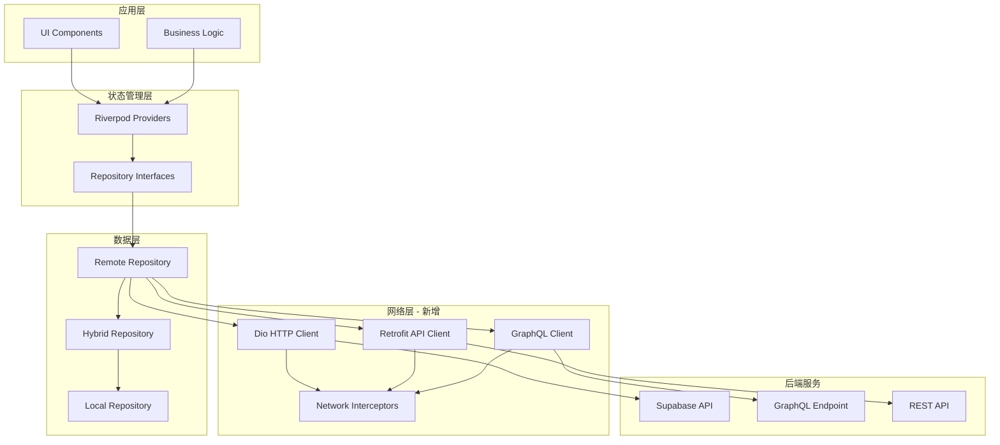

# SubscriptionManager 网络层技术集成设计

## 1. 概述

为 SubscriptionManager Flutter 应用集成现代化网络技术栈，包括 Dio HTTP 客户端、Retrofit 类型安全 API 客户端生成器和 GraphQL 查询系统，以提升网络层的稳定性、类型安全性和数据查询效率。

### 1.1 技术选型理由

- **Dio**: 提供拦截器、重试机制、请求/响应变换等高级功能
- **Retrofit**: 基于注解的类型安全 API 客户端生成，减少模板代码
- **GraphQL**: 精确数据查询，减少数据传输量，提供强类型查询能力

### 1.2 集成目标

- 替换现有基础 HTTP 客户端为 Dio
- 为订阅管理 API 生成类型安全的客户端
- 实现 GraphQL 数据查询优化
- 保持与现有 Supabase 架构的兼容性

## 2. 技术架构

### 2.1 网络层架构图



### 2.2 依赖配置

#### pubspec.yaml 新增依赖

```yaml
dependencies:
  # HTTP 客户端
  dio: ^5.3.2
  retrofit: ^4.0.3
  
  # GraphQL
  graphql_flutter: ^5.1.2
  gql: ^0.14.0
  
  # JSON 序列化
  json_annotation: ^4.8.1

dev_dependencies:
  # 代码生成
  retrofit_generator: ^8.0.4
  gql_code_builder: ^0.8.0
  build_runner: ^2.4.7
```

## 3. Dio HTTP 客户端集成

### 3.1 Dio 客户端配置

```dart
// lib/network/dio_client.dart
class DioClient {
  static Dio? _instance;
  
  static Dio get instance {
    _instance ??= _createDio();
    return _instance!;
  }
  
  static Dio _createDio() {
    final dio = Dio(BaseOptions(
      baseUrl: SupabaseConfig.supabaseUrl,
      connectTimeout: Duration(seconds: 30),
      receiveTimeout: Duration(seconds: 30),
      sendTimeout: Duration(seconds: 30),
      headers: {
        'Content-Type': 'application/json',
        'apikey': SupabaseConfig.supabaseAnonKey,
      },
    ));
    
    // 添加拦截器
    dio.interceptors.addAll([
      AuthInterceptor(),
      RetryInterceptor(),
      LoggingInterceptor(),
      ErrorInterceptor(),
    ]);
    
    return dio;
  }
}
```

### 3.2 网络拦截器实现

#### 认证拦截器

```dart
// lib/network/interceptors/auth_interceptor.dart
class AuthInterceptor extends Interceptor {
  @override
  void onRequest(RequestOptions options, RequestInterceptorHandler handler) {
    final token = SupabaseConfig.currentUser?.accessToken;
    if (token != null) {
      options.headers['Authorization'] = 'Bearer $token';
    }
    handler.next(options);
  }
}
```

#### 重试拦截器

```dart
// lib/network/interceptors/retry_interceptor.dart
class RetryInterceptor extends Interceptor {
  final int maxRetries;
  final Duration retryDelay;
  
  RetryInterceptor({
    this.maxRetries = 3,
    this.retryDelay = const Duration(seconds: 1),
  });
  
  @override
  void onError(DioException err, ErrorInterceptorHandler handler) async {
    if (_shouldRetry(err) && err.requestOptions.extra['retryCount'] < maxRetries) {
      err.requestOptions.extra['retryCount'] = 
          (err.requestOptions.extra['retryCount'] ?? 0) + 1;
      
      await Future.delayed(retryDelay);
      
      try {
        final response = await DioClient.instance.fetch(err.requestOptions);
        handler.resolve(response);
      } catch (e) {
        handler.next(err);
      }
    } else {
      handler.next(err);
    }
  }
  
  bool _shouldRetry(DioException err) {
    return err.type == DioExceptionType.connectionTimeout ||
           err.type == DioExceptionType.receiveTimeout ||
           err.type == DioExceptionType.sendTimeout ||
           (err.response?.statusCode != null && 
            err.response!.statusCode! >= 500);
  }
}
```

## 4. Retrofit API 客户端生成

### 4.1 订阅服务 API 接口定义

```dart
// lib/network/api/subscription_api.dart
@RestApi()
abstract class SubscriptionApi {
  factory SubscriptionApi(Dio dio, {String? baseUrl}) = _SubscriptionApi;
  
  @GET('/subscriptions')
  Future<List<SubscriptionDto>> getSubscriptions(
    @Query('user_id') String userId,
    @Query('is_active') bool isActive,
  );
  
  @GET('/subscriptions/{id}')
  Future<SubscriptionDto> getSubscription(@Path('id') String id);
  
  @POST('/subscriptions')
  Future<SubscriptionDto> createSubscription(
    @Body() CreateSubscriptionRequest request,
  );
  
  @PUT('/subscriptions/{id}')
  Future<SubscriptionDto> updateSubscription(
    @Path('id') String id,
    @Body() UpdateSubscriptionRequest request,
  );
  
  @DELETE('/subscriptions/{id}')
  Future<void> deleteSubscription(@Path('id') String id);
  
  @GET('/subscriptions/search')
  Future<List<SubscriptionDto>> searchSubscriptions(
    @Query('query') String query,
    @Query('user_id') String userId,
  );
  
  @GET('/subscriptions/upcoming')
  Future<List<SubscriptionDto>> getUpcomingSubscriptions(
    @Query('user_id') String userId,
    @Query('days_ahead') int daysAhead,
  );
}
```

### 4.2 数据传输对象 (DTO)

```dart
// lib/network/dto/subscription_dto.dart
@JsonSerializable()
class SubscriptionDto {
  final String id;
  final String name;
  final double price;
  final String currency;
  final String billingCycle;
  final DateTime nextRenewalDate;
  final bool autoRenewal;
  final String? description;
  final String? iconName;
  final DateTime createdAt;
  final DateTime updatedAt;
  
  const SubscriptionDto({
    required this.id,
    required this.name,
    required this.price,
    required this.currency,
    required this.billingCycle,
    required this.nextRenewalDate,
    required this.autoRenewal,
    this.description,
    this.iconName,
    required this.createdAt,
    required this.updatedAt,
  });
  
  factory SubscriptionDto.fromJson(Map<String, dynamic> json) =>
      _$SubscriptionDtoFromJson(json);
  
  Map<String, dynamic> toJson() => _$SubscriptionDtoToJson(this);
  
  // 转换为领域模型
  Subscription toDomain() => Subscription(
    id: id,
    name: name,
    price: price,
    currency: currency,
    billingCycle: billingCycle,
    nextRenewalDate: nextRenewalDate,
    autoRenewal: autoRenewal,
    description: description,
    iconName: iconName,
    createdAt: createdAt,
    updatedAt: updatedAt,
  );
}
```

### 4.3 请求/响应模型

```dart
// lib/network/dto/requests.dart
@JsonSerializable()
class CreateSubscriptionRequest {
  final String name;
  final double price;
  final String currency;
  final String billingCycle;
  final DateTime nextRenewalDate;
  final bool autoRenewal;
  final String? description;
  final String? iconName;
  
  const CreateSubscriptionRequest({
    required this.name,
    required this.price,
    required this.currency,
    required this.billingCycle,
    required this.nextRenewalDate,
    required this.autoRenewal,
    this.description,
    this.iconName,
  });
  
  factory CreateSubscriptionRequest.fromJson(Map<String, dynamic> json) =>
      _$CreateSubscriptionRequestFromJson(json);
  
  Map<String, dynamic> toJson() => _$CreateSubscriptionRequestToJson(this);
}
```

## 5. GraphQL 客户端集成

### 5.1 GraphQL 客户端配置

```dart
// lib/network/graphql_client.dart
class GraphQLClientManager {
  static GraphQLClient? _instance;
  
  static GraphQLClient get instance {
    _instance ??= _createClient();
    return _instance!;
  }
  
  static GraphQLClient _createClient() {
    final httpLink = HttpLink(
      '${SupabaseConfig.supabaseUrl}/graphql/v1',
      defaultHeaders: {
        'apikey': SupabaseConfig.supabaseAnonKey,
        'Content-Type': 'application/json',
      },
    );
    
    final authLink = AuthLink(
      getToken: () async {
        final token = SupabaseConfig.currentUser?.accessToken;
        return token != null ? 'Bearer $token' : null;
      },
    );
    
    final link = Link.from([authLink, httpLink]);
    
    return GraphQLClient(
      link: link,
      cache: GraphQLCache(store: InMemoryStore()),
      defaultPolicies: DefaultPolicies(
        watchQuery: Policies(
          fetch: FetchPolicy.cacheAndNetwork,
        ),
        query: Policies(
          fetch: FetchPolicy.cacheFirst,
        ),
      ),
    );
  }
}
```

### 5.2 GraphQL 查询定义

```graphql
# lib/network/graphql/subscription_queries.graphql

query GetSubscriptions($userId: UUID!, $isActive: Boolean!) {
  subscriptionsCollection(
    filter: { user_id: { eq: $userId }, is_active: { eq: $isActive } }
    orderBy: { created_at: DescNullsLast }
  ) {
    edges {
      node {
        id
        name
        price
        currency
        billing_cycle
        next_renewal_date
        auto_renewal
        description
        icon_name
        created_at
        updated_at
      }
    }
  }
}

query GetSubscriptionById($id: UUID!) {
  subscriptionsCollection(filter: { id: { eq: $id } }) {
    edges {
      node {
        id
        name
        price
        currency
        billing_cycle
        next_renewal_date
        auto_renewal
        description
        icon_name
        created_at
        updated_at
      }
    }
  }
}

mutation CreateSubscription($input: SubscriptionsInsertInput!) {
  insertIntoSubscriptionsCollection(objects: [$input]) {
    records {
      id
      name
      price
      currency
      billing_cycle
      next_renewal_date
      auto_renewal
      description
      icon_name
      created_at
      updated_at
    }
  }
}

query GetSubscriptionStatistics($userId: UUID!) {
  subscriptionsCollection(
    filter: { user_id: { eq: $userId }, is_active: { eq: true } }
  ) {
    edges {
      node {
        price
        billing_cycle
        currency
      }
    }
  }
}
```

### 5.3 GraphQL 代码生成

```dart
// lib/network/graphql/subscription_graphql.dart
// 此文件将通过 gql_code_builder 自动生成

@GraphQLQuery()
const String getSubscriptionsQuery = r'''
  query GetSubscriptions($userId: UUID!, $isActive: Boolean!) {
    subscriptionsCollection(
      filter: { user_id: { eq: $userId }, is_active: { eq: $isActive } }
      orderBy: { created_at: DescNullsLast }
    ) {
      edges {
        node {
          id
          name
          price
          currency
          billing_cycle
          next_renewal_date
          auto_renewal
          description
          icon_name
          created_at
          updated_at
        }
      }
    }
  }
''';
```

## 6. 网络层 Repository 实现

### 6.1 增强的远程订阅 Repository

```dart
// lib/repositories/enhanced_remote_subscription_repository.dart
class EnhancedRemoteSubscriptionRepository 
    with ErrorHandler 
    implements SubscriptionRepository {
  
  final SubscriptionApi _api;
  final GraphQLClient _graphqlClient;
  
  EnhancedRemoteSubscriptionRepository({
    SubscriptionApi? api,
    GraphQLClient? graphqlClient,
  }) : _api = api ?? SubscriptionApi(DioClient.instance),
        _graphqlClient = graphqlClient ?? GraphQLClientManager.instance;
  
  @override
  Future<List<Subscription>> getAllSubscriptions() async {
    try {
      _ensureUserLoggedIn();
      
      // 使用 GraphQL 查询优化数据获取
      final result = await _graphqlClient.query(
        QueryOptions(
          document: gql(getSubscriptionsQuery),
          variables: {
            'userId': _currentUserId!,
            'isActive': true,
          },
        ),
      );
      
      if (result.hasException) {
        throw result.exception!;
      }
      
      final subscriptions = result.data?['subscriptionsCollection']?['edges']
          ?.map<Subscription>((edge) => 
              SubscriptionDto.fromJson(edge['node']).toDomain())
          ?.toList() ?? <Subscription>[];
      
      return subscriptions;
    } catch (e) {
      // 降级到 REST API
      return _fallbackToRestApi();
    }
  }
  
  @override
  Future<void> addSubscription(Subscription subscription) async {
    try {
      _ensureUserLoggedIn();
      
      final request = CreateSubscriptionRequest(
        name: subscription.name,
        price: subscription.price,
        currency: subscription.currency,
        billingCycle: subscription.billingCycle,
        nextRenewalDate: subscription.nextRenewalDate,
        autoRenewal: subscription.autoRenewal,
        description: subscription.description,
        iconName: subscription.iconName,
      );
      
      await _api.createSubscription(request);
    } catch (e) {
      throw Exception(getErrorMessage(e is Exception ? e : Exception(e.toString())));
    }
  }
  
  Future<List<Subscription>> _fallbackToRestApi() async {
    final dtos = await _api.getSubscriptions(_currentUserId!, true);
    return dtos.map((dto) => dto.toDomain()).toList();
  }
  
  String? get _currentUserId => SupabaseConfig.currentUser?.id;
  
  void _ensureUserLoggedIn() {
    if (_currentUserId == null) {
      throw Exception('用户未登录');
    }
  }
}
```

## 7. 错误处理和监控

### 7.1 网络错误处理策略

```dart
// lib/network/error_handler.dart
class NetworkErrorHandler {
  static Exception handleDioError(DioException error) {
    switch (error.type) {
      case DioExceptionType.connectionTimeout:
        return NetworkException('连接超时，请检查网络连接');
      case DioExceptionType.sendTimeout:
        return NetworkException('发送超时，请重试');
      case DioExceptionType.receiveTimeout:
        return NetworkException('接收超时，请重试');
      case DioExceptionType.badResponse:
        return _handleResponseError(error.response!);
      case DioExceptionType.cancel:
        return NetworkException('请求已取消');
      case DioExceptionType.unknown:
        return NetworkException('网络错误：${error.message}');
      default:
        return NetworkException('未知网络错误');
    }
  }
  
  static Exception _handleResponseError(Response response) {
    switch (response.statusCode) {
      case 400:
        return ValidationException('请求参数错误');
      case 401:
        return AuthenticationException('身份验证失败');
      case 403:
        return AuthorizationException('权限不足');
      case 404:
        return NotFoundException('资源不存在');
      case 429:
        return RateLimitException('请求过于频繁，请稍后重试');
      case 500:
        return ServerException('服务器内部错误');
      case 502:
        return ServerException('网关错误');
      case 503:
        return ServerException('服务不可用');
      default:
        return NetworkException('HTTP ${response.statusCode}: ${response.statusMessage}');
    }
  }
}
```

### 7.2 网络监控和日志

```dart
// lib/network/interceptors/logging_interceptor.dart
class LoggingInterceptor extends Interceptor {
  @override
  void onRequest(RequestOptions options, RequestInterceptorHandler handler) {
    print('REQUEST[${options.method}] => PATH: ${options.path}');
    print('Headers: ${options.headers}');
    print('Data: ${options.data}');
    handler.next(options);
  }
  
  @override
  void onResponse(Response response, ResponseInterceptorHandler handler) {
    print('RESPONSE[${response.statusCode}] => PATH: ${response.requestOptions.path}');
    print('Data: ${response.data}');
    handler.next(response);
  }
  
  @override
  void onError(DioException err, ErrorInterceptorHandler handler) {
    print('ERROR[${err.response?.statusCode}] => PATH: ${err.requestOptions.path}');
    print('Message: ${err.message}');
    handler.next(err);
  }
}
```

## 8. 性能优化策略

### 8.1 缓存策略

```dart
// lib/network/cache/network_cache_manager.dart
class NetworkCacheManager {
  static final Map<String, CachedResponse> _cache = {};
  static const Duration defaultCacheDuration = Duration(minutes: 5);
  
  static void cacheResponse(String key, dynamic data, {Duration? duration}) {
    _cache[key] = CachedResponse(
      data: data,
      timestamp: DateTime.now(),
      duration: duration ?? defaultCacheDuration,
    );
  }
  
  static T? getCachedResponse<T>(String key) {
    final cached = _cache[key];
    if (cached != null && !cached.isExpired) {
      return cached.data as T?;
    }
    _cache.remove(key);
    return null;
  }
  
  static void clearCache() {
    _cache.clear();
  }
}

class CachedResponse {
  final dynamic data;
  final DateTime timestamp;
  final Duration duration;
  
  CachedResponse({
    required this.data,
    required this.timestamp,
    required this.duration,
  });
  
  bool get isExpired => DateTime.now().difference(timestamp) > duration;
}
```

### 8.2 请求去重

```dart
// lib/network/request_deduplicator.dart
class RequestDeduplicator {
  static final Map<String, Future> _pendingRequests = {};
  
  static Future<T> deduplicate<T>(String key, Future<T> Function() request) {
    if (_pendingRequests.containsKey(key)) {
      return _pendingRequests[key] as Future<T>;
    }
    
    final future = request().whenComplete(() {
      _pendingRequests.remove(key);
    });
    
    _pendingRequests[key] = future;
    return future;
  }
}
```

## 9. 测试策略

### 9.1 单元测试

```dart
// test/network/dio_client_test.dart
void main() {
  group('DioClient', () {
    test('should configure dio with correct base options', () {
      final dio = DioClient.instance;
      
      expect(dio.options.baseUrl, equals(SupabaseConfig.supabaseUrl));
      expect(dio.options.connectTimeout, equals(Duration(seconds: 30)));
      expect(dio.interceptors.length, greaterThan(0));
    });
  });
}

// test/network/subscription_api_test.dart
void main() {
  group('SubscriptionApi', () {
    late MockDio mockDio;
    late SubscriptionApi api;
    
    setUp(() {
      mockDio = MockDio();
      api = SubscriptionApi(mockDio);
    });
    
    test('should get subscriptions successfully', () async {
      when(mockDio.get(any)).thenAnswer((_) async => Response(
        data: [mockSubscriptionJson],
        statusCode: 200,
        requestOptions: RequestOptions(path: '/subscriptions'),
      ));
      
      final result = await api.getSubscriptions('user-id', true);
      
      expect(result, isA<List<SubscriptionDto>>());
      expect(result.length, equals(1));
    });
  });
}
```

### 9.2 集成测试

```dart
// integration_test/network_integration_test.dart
void main() {
  group('Network Integration Tests', () {
    testWidgets('should perform full CRUD operations', (tester) async {
      // 测试创建、读取、更新、删除订阅的完整流程
      final repository = EnhancedRemoteSubscriptionRepository();
      
      // 创建订阅
      final subscription = Subscription(
        id: uuid.v4(),
        name: 'Test Subscription',
        price: 9.99,
        currency: 'USD',
        billingCycle: 'monthly',
        nextRenewalDate: DateTime.now().add(Duration(days: 30)),
        autoRenewal: true,
      );
      
      await repository.addSubscription(subscription);
      
      // 验证创建成功
      final subscriptions = await repository.getAllSubscriptions();
      expect(subscriptions.any((s) => s.name == 'Test Subscription'), isTrue);
      
      // 清理测试数据
      await repository.deleteSubscription(subscription.id);
    });
  });
}
```

## 10. 迁移计划

### 10.1 分阶段迁移策略

#### 阶段 1: 基础设施搭建
- 添加 Dio、Retrofit、GraphQL 依赖
- 配置基础网络客户端
- 实现核心拦截器

#### 阶段 2: API 客户端生成
- 定义 Retrofit API 接口
- 生成类型安全的客户端代码
- 实现基础 CRUD 操作

#### 阶段 3: GraphQL 集成
- 配置 GraphQL 客户端
- 定义核心查询和变更
- 实现查询优化

#### 阶段 4: 增强功能
- 实现高级缓存策略
- 添加请求去重机制
- 优化错误处理

#### 阶段 5: 测试和优化
- 完善单元测试和集成测试
- 性能测试和优化
- 监控和日志完善

### 10.2 兼容性保证

- 保持现有 Repository 接口不变
- 渐进式替换底层实现
- 提供降级机制确保服务可用性
- 支持新旧客户端并行运行

## 11. 监控和维护

### 11.1 网络性能监控

```dart
// lib/network/monitoring/network_monitor.dart
class NetworkMonitor {
  static void trackRequest(String endpoint, Duration duration, bool success) {
    // 记录请求性能数据
    final metrics = RequestMetrics(
      endpoint: endpoint,
      duration: duration,
      success: success,
      timestamp: DateTime.now(),
    );
    
    // 发送到分析服务
    _sendMetrics(metrics);
  }
  
  static void trackError(String endpoint, String errorType) {
    // 记录错误信息
    final error = NetworkError(
      endpoint: endpoint,
      errorType: errorType,
      timestamp: DateTime.now(),
    );
    
    // 发送错误报告
    _sendErrorReport(error);
  }
}
```

### 11.2 健康检查

```dart
// lib/network/health_check.dart
class NetworkHealthChecker {
  static Future<HealthStatus> checkHealth() async {
    try {
      final dio = DioClient.instance;
      final response = await dio.get('/health');
      
      return HealthStatus(
        isHealthy: response.statusCode == 200,
        latency: response.extra['requestDuration'],
        timestamp: DateTime.now(),
      );
    } catch (e) {
      return HealthStatus(
        isHealthy: false,
        error: e.toString(),
        timestamp: DateTime.now(),
      );
    }
  }
}
```