# 状态管理升级：Provider → Riverpod + Freezed

## 概述

将 SubscriptionManager 项目的状态管理从 Provider 升级到 Riverpod + Freezed，以提供更强的类型安全、更好的开发体验和更简洁的状态管理模式。

### 升级目标
- 替换 Provider 为 Riverpod 实现响应式状态管理
- 使用 Freezed 生成不可变数据模型
- 提高代码的类型安全性和可维护性
- 简化状态更新逻辑，减少样板代码
- 保持现有功能完整性

## 架构对比

### 当前架构（Provider）
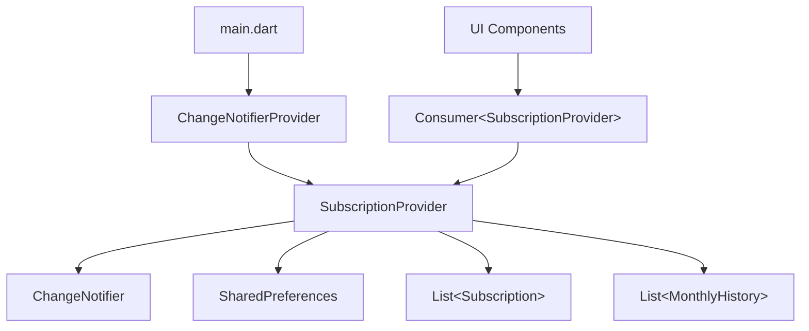

### 目标架构（Riverpod + Freezed）
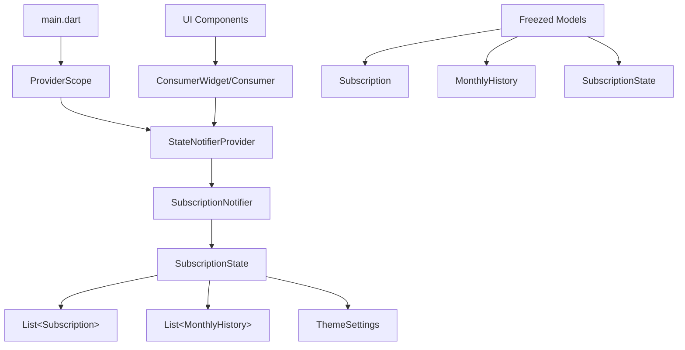

## 数据模型升级

### Subscription 模型改造

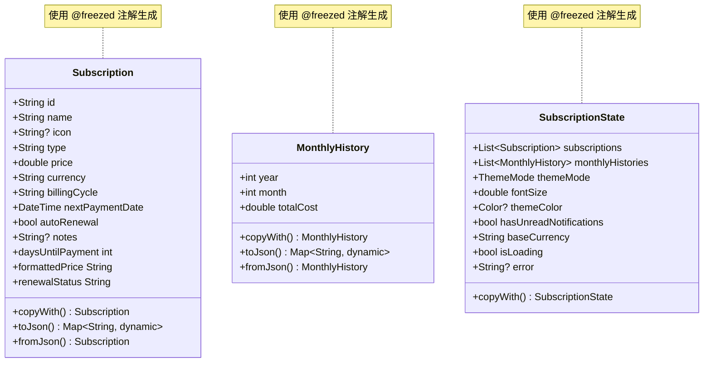

### 状态管理层级

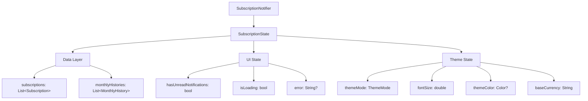

## Provider 架构设计

### 核心 Providers

| Provider名称 | 类型 | 作用 |
|-------------|------|------|
| `subscriptionProvider` | StateNotifierProvider | 管理订阅数据和业务逻辑 |
| `themeProvider` | StateNotifierProvider | 管理主题设置 |
| `exchangeRateProvider` | Provider | 提供汇率转换服务 |
| `preferencesProvider` | Provider | 提供SharedPreferences实例 |

### 依赖关系

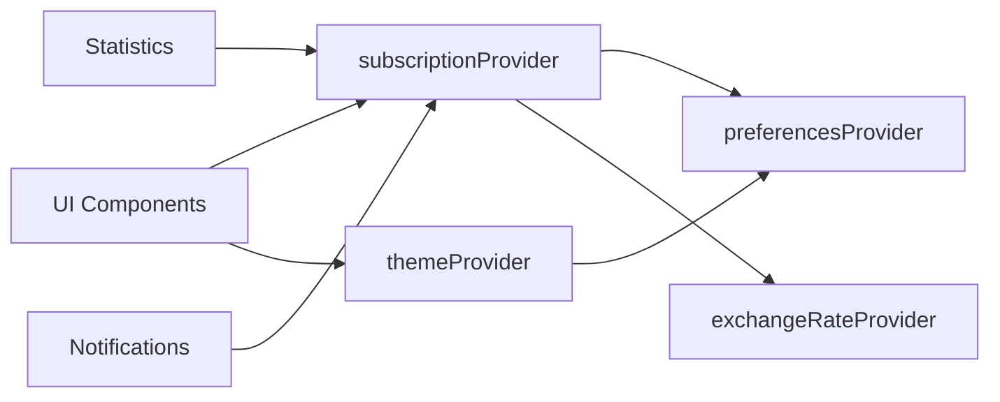

## 业务逻辑重构

### 状态更新流程

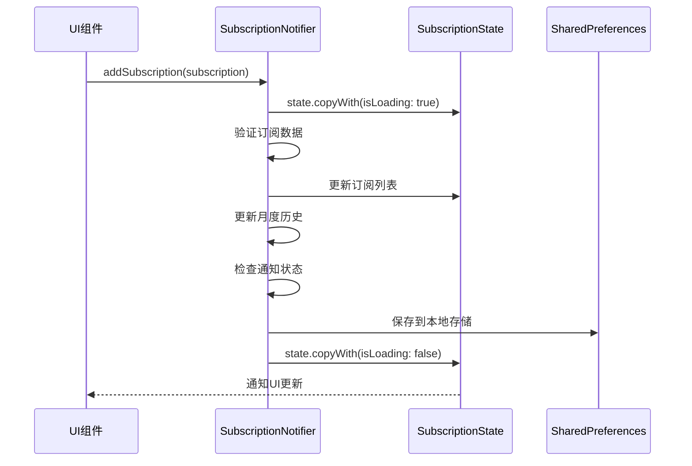

### 错误处理机制

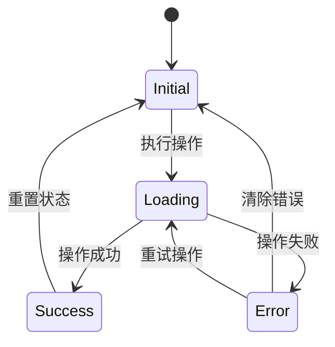

## 依赖管理

### 新增依赖项

| 依赖包 | 版本 | 用途 |
|--------|------|------|
| `flutter_riverpod` | ^2.4.9 | 响应式状态管理 |
| `riverpod_annotation` | ^2.3.3 | Riverpod代码生成注解 |
| `freezed` | ^2.4.6 | 不可变数据类生成 |
| `freezed_annotation` | ^2.4.1 | Freezed注解 |
| `json_serialization` | ^6.7.1 | JSON序列化 |
| `json_annotation` | ^4.8.1 | JSON注解 |

### 开发依赖

| 依赖包 | 版本 | 用途 |
|--------|------|------|
| `riverpod_generator` | ^2.3.9 | Riverpod代码生成 |
| `build_runner` | ^2.4.7 | 代码生成工具 |

## 迁移策略

### 阶段性迁移方案

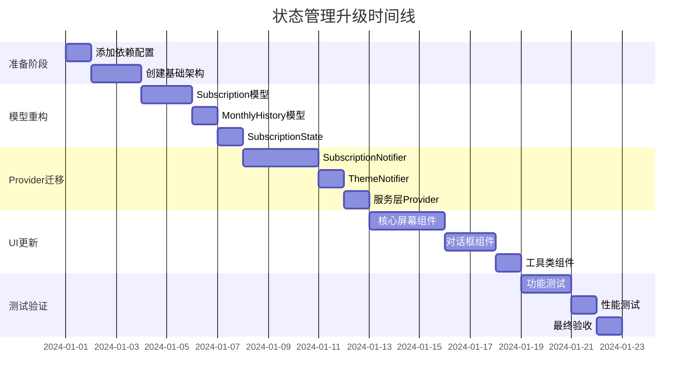

### 兼容性保证

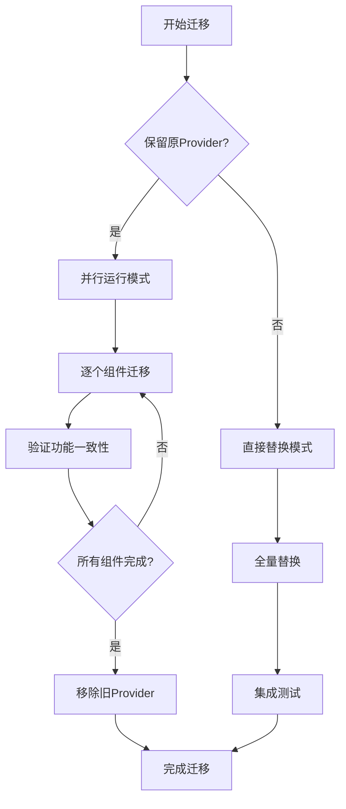

## 代码生成配置

### build.yaml 配置

```yaml
targets:
  $default:
    builders:
      riverpod_generator:
        options:
          # Riverpod代码生成选项
          provider_name_prefix: ''
          provider_name_suffix: 'Provider'
      freezed:
        options:
          # Freezed代码生成选项
          copy_with: true
          equal: true
          to_string: true
      json_serializable:
        options:
          # JSON序列化选项
          explicit_to_json: true
          include_if_null: false
```

### 生成命令

| 命令 | 用途 |
|------|------|
| `dart run build_runner build` | 生成代码 |
| `dart run build_runner watch` | 监听模式生成 |
| `dart run build_runner clean` | 清理生成文件 |

## 性能优化

### 状态分片策略

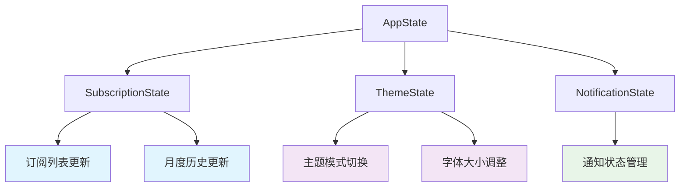

### 选择器优化

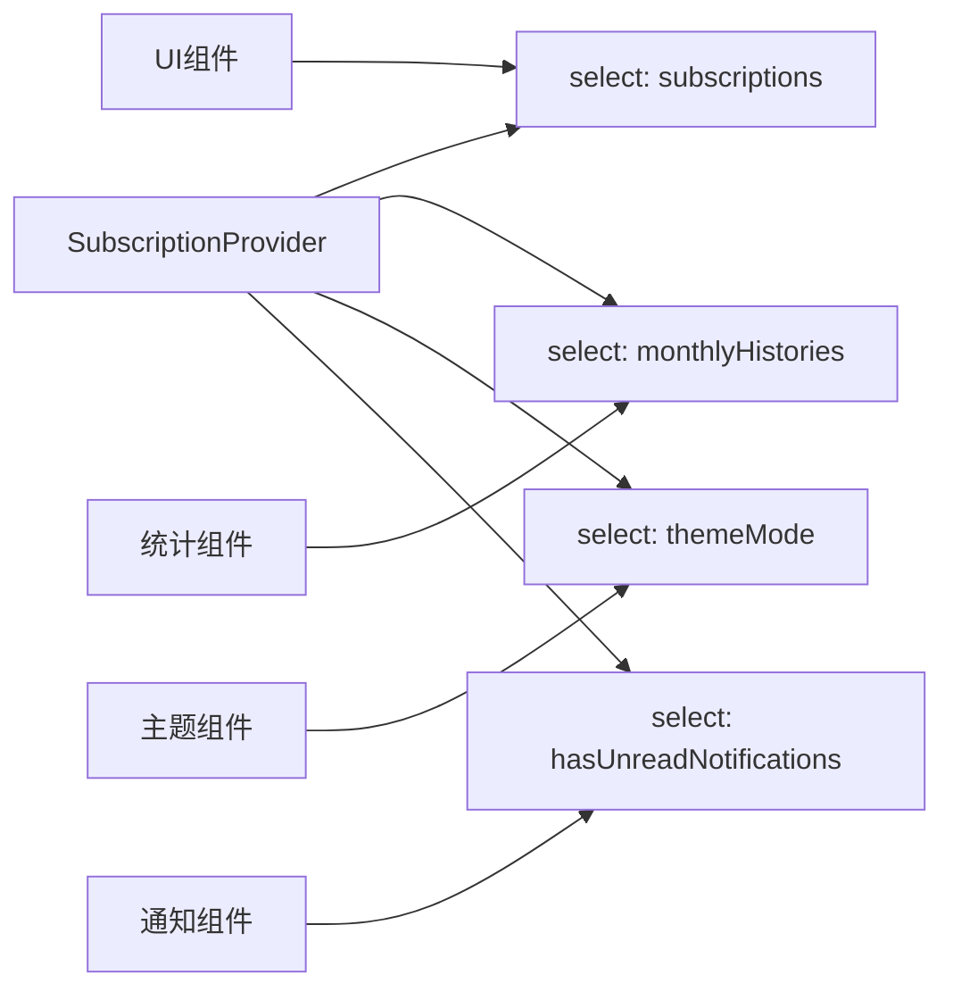

## 测试策略

### 单元测试覆盖

| 测试类别 | 覆盖组件 | 测试重点 |
|----------|----------|----------|
| Model测试 | Freezed模型 | 序列化、反序列化、copyWith |
| Provider测试 | StateNotifier | 状态变更逻辑、异步操作 |
| Service测试 | 业务服务 | 汇率转换、数据持久化 |
| Widget测试 | UI组件 | 响应状态变更、用户交互 |

### 测试工具

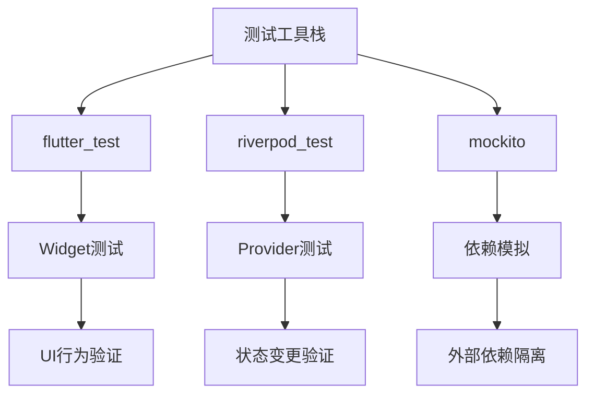

## 风险评估

### 技术风险

| 风险类别 | 风险描述 | 影响程度 | 应对策略 |
|----------|----------|----------|----------|
| 学习成本 | 团队对Riverpod不熟悉 | 中 | 提供培训文档和示例代码 |
| 迁移复杂度 | 大量代码需要重构 | 高 | 采用渐进式迁移策略 |
| 兼容性问题 | 新旧代码并存期间的冲突 | 中 | 建立严格的迁移验证流程 |
| 性能退化 | 迁移过程中可能的性能问题 | 低 | 建立性能基准测试 |

### 回滚方案

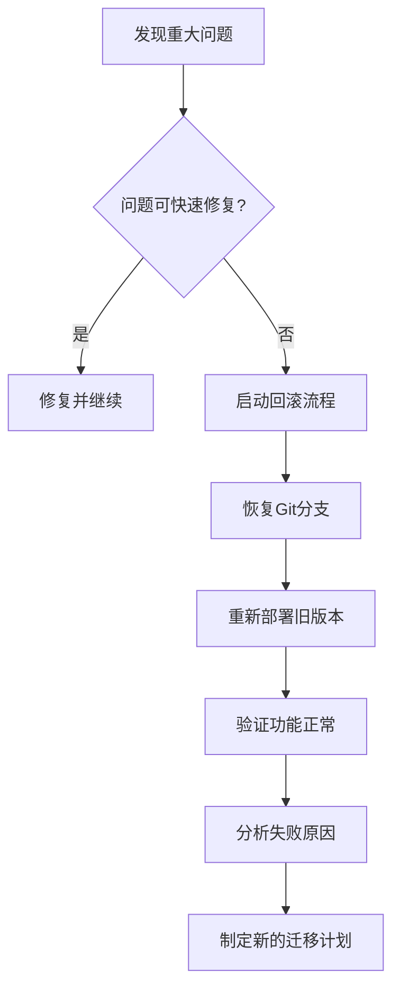

## 验收标准

### 功能验收

- [ ] 所有现有功能正常工作
- [ ] 订阅的增删改查操作无异常
- [ ] 主题设置和货币转换功能正常
- [ ] 通知状态管理正确
- [ ] 数据持久化功能完整

### 性能验收

- [ ] 应用启动时间不超过当前版本10%
- [ ] 内存使用量不超过当前版本15%
- [ ] UI响应时间保持在同等水平
- [ ] 状态更新频率优化合理

### 代码质量验收

- [ ] 代码覆盖率达到80%以上
- [ ] 所有lint检查通过
- [ ] 文档完整且准确
- [ ] 代码review通过

## 后续优化方向

### 长期架构演进

```mermaid
roadmap
    title 状态管理架构演进路线图
    section 当前阶段
        Provider迁移完成     :done, milestone, m1, 2024-01-15, 0d
    section 短期优化
        性能调优           :active, opt1, after m1, 2w
        错误处理增强        :opt2, after opt1, 1w
    section 中期扩展
        离线支持           :exp1, after opt2, 3w
        数据库迁移         :exp2, after exp1, 2w
    section 长期规划
        微前端架构         :future1, after exp2, 4w
        云端同步          :future2, after future1, 3w
```

### 技术债务处理

| 技术债务项 | 优先级 | 预估工作量 | 计划处理时间 |
|------------|--------|------------|--------------|
| SharedPreferences替换为Hive | 高 | 1周 | 迁移后1个月 |
| 添加完整的错误处理机制 | 高 | 2周 | 迁移后2周 |
| 实现数据备份和恢复功能 | 中 | 1周 | 迁移后2个月 |
| 优化国际化支持 | 低 | 3天 | 迁移后3个月 |