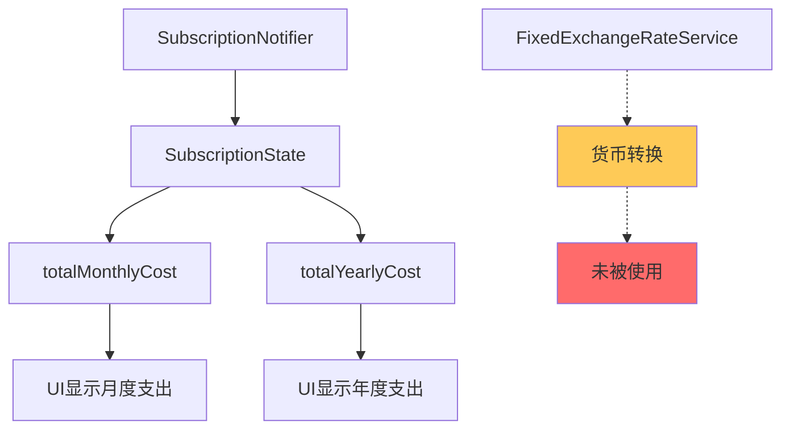
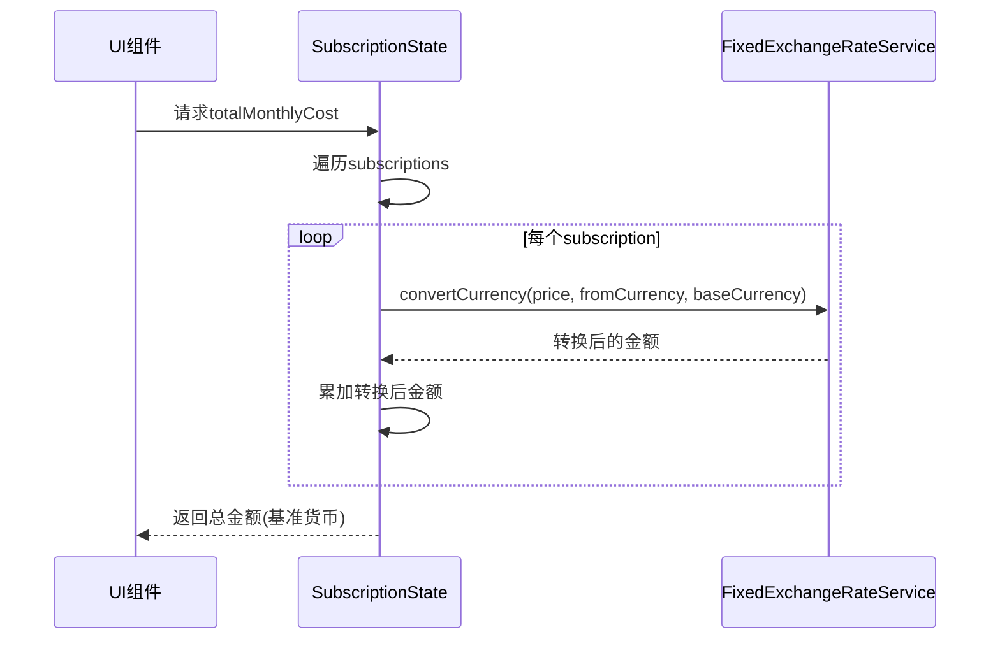
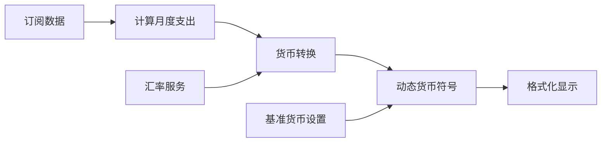
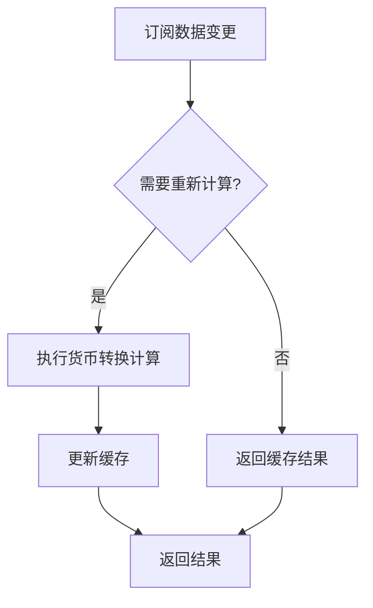

# 订阅货币转换与统计显示问题分析与解决方案

## 问题概述

通过代码分析发现，SubscriptionManager应用中存在以下关键问题：

1. **统计页面月度/年度支出显示为0** - 货币转换逻辑缺失
2. **主页本月支出计算错误** - 未进行货币转换到基准货币
3. **计费周期字段不匹配** - 代码中存在中文和英文字段值的不一致问题

## 架构分析

### 当前数据流架构



### 问题根源

| 组件 | 当前实现 | 问题 |
|------|---------|------|
| `SubscriptionState.totalMonthlyCost` | 直接累加订阅价格 | 未考虑货币转换 |
| `SubscriptionState.totalYearlyCost` | 直接累加订阅价格 | 未考虑货币转换 |
| `StatisticsScreen` | 使用State中的计算值 | 显示结果为0或错误 |
| `HomeStatisticsCard` | 硬编码¥符号 | 不支持动态基准货币 |

## 具体问题分析

### 问题1: 计费周期字段不匹配

**代码位置**: `lib/models/subscription_state.dart:38-48`

```dart
// 当前错误实现
if (subscription.billingCycle == 'monthly') {  // 英文
  total += subscription.price;
} else if (subscription.billingCycle == 'yearly') {  // 英文
  total += subscription.price / 12;
}
```

**实际数据**: 根据其他代码分析，计费周期使用中文值：
- `'每月'` (不是 `'monthly'`)
- `'每年'` (不是 `'yearly'`)

### 问题2: 缺少货币转换逻辑

**当前实现**:
```dart
// SubscriptionState中的计算
double get totalMonthlyCost {
  double total = 0.0;
  for (final subscription in subscriptions) {
    // 直接累加，未进行货币转换
    total += subscription.price; 
  }
  return total;
}
```

**正确逻辑**:
```dart
// 应该调用FixedExchangeRateService进行转换
final convertedAmount = exchangeRateService.convertCurrency(
  amount, 
  subscription.currency, 
  baseCurrency
);
```

### 问题3: UI层硬编码货币符号

**HomeStatisticsCard问题**:
```dart
// 硬编码¥符号
Text('¥${monthlyCost.toStringAsFixed(2)}')
```

应该根据基准货币动态显示：
```dart
Text('${getCurrencySymbol(baseCurrency)}${monthlyCost.toStringAsFixed(2)}')
```

## 解决方案设计

### 方案1: 修复SubscriptionState计算逻辑

#### 数据流重设计



#### 实现方法

由于`SubscriptionState`是数据模型类，无法直接注入服务，需要通过以下方式之一解决：

**选项A**: 在State中添加货币转换逻辑
- 创建`totalMonthlyCostInBaseCurrency(String baseCurrency)`方法
- 在计算时传入基准货币和汇率服务

**选项B**: 在Notifier中提供计算方法
- 保持State简单，在`SubscriptionNotifier`中添加计算方法
- UI层调用Notifier的方法获取转换后的金额

### 方案2: 统一计费周期字段值

#### 字段标准化

| 当前混乱状态 | 标准化方案 |
|------------|-----------|
| 'monthly' / '每月' | 统一为 '每月' |
| 'yearly' / '每年' | 统一为 '每年' |
| 'once' / '一次性' | 统一为 '一次性' |

#### 代码修复点

1. **SubscriptionState.dart**: 修复计费周期字段匹配
2. **SubscriptionNotifier.dart**: 确保一致性
3. **UI层**: 统一使用中文字段值

### 方案3: UI层货币显示优化

#### HomeStatisticsCard改进



#### 实现要点

1. **动态货币符号**: 根据基准货币显示正确符号
2. **实时更新**: 基准货币变更时自动刷新显示
3. **错误处理**: 转换失败时的降级显示

## 技术实现细节

### 修复SubscriptionState

```dart
// 在SubscriptionState中添加
double totalMonthlyCostInCurrency(String baseCurrency, FixedExchangeRateService service) {
  double total = 0.0;
  for (final subscription in subscriptions) {
    double amount = 0.0;
    
    // 修复计费周期匹配
    if (subscription.billingCycle == '每月') {
      amount = subscription.price;
    } else if (subscription.billingCycle == '每年') {
      amount = subscription.price / 12;
    } else if (subscription.billingCycle == '一次性') {
      amount = subscription.price / 12; // 分摊到12个月
    }
    
    // 进行货币转换
    final convertedAmount = service.convertCurrency(
      amount,
      subscription.currency,
      baseCurrency,
    );
    
    total += convertedAmount;
  }
  return total;
}
```

### 优化UI组件

```dart
// HomeStatisticsCard中的改进
Widget _buildStatisticsContent(BuildContext context, SubscriptionState state, WidgetRef ref) {
  final notifier = ref.read(subscriptionNotifierProvider.notifier);
  
  // 使用Notifier的方法获取转换后的金额
  return FutureBuilder<double>(
    future: notifier.getMonthlyCost(),
    builder: (context, snapshot) {
      final monthlyCost = snapshot.data ?? 0.0;
      final baseCurrency = state.baseCurrency;
      
      return Text(
        '${_getCurrencySymbol(baseCurrency)}${monthlyCost.toStringAsFixed(2)}'
      );
    },
  );
}
```

## 测试策略

### 单元测试场景

| 测试场景 | 输入 | 期望输出 |
|---------|------|----------|
| 单一货币计算 | 3个CNY订阅 | 正确CNY总额 |
| 多货币转换 | CNY+USD+EUR混合 | 转换为基准货币总额 |
| 计费周期混合 | 月付+年付组合 | 正确月度分摊 |
| 汇率转换精度 | 小数金额转换 | 精度保持2位小数 |

### 集成测试

1. **添加订阅后统计更新**
2. **基准货币切换后重新计算**
3. **不同计费周期订阅的混合计算**
4. **错误处理和降级显示**

## 性能优化考虑

### 计算缓存策略



### 优化点

1. **避免重复计算**: 订阅数据未变更时使用缓存
2. **批量转换**: 一次性转换所有需要的货币
3. **异步计算**: 大量订阅时避免阻塞UI

## 风险评估

### 高风险项

1. **数据一致性**: 计费周期字段修复可能影响现有数据
2. **性能影响**: 货币转换计算增加计算开销
3. **精度丢失**: 多次货币转换可能累积误差

### 缓解措施

1. **数据迁移**: 提供字段值标准化的迁移脚本
2. **性能监控**: 监控计算时间，必要时添加缓存
3. **精度控制**: 使用固定小数位数，避免浮点数误差

## 实施计划

### 阶段1: 核心逻辑修复
1. 修复SubscriptionState中的计费周期匹配
2. 添加货币转换逻辑到计算方法
3. 更新SubscriptionNotifier中的相关方法

### 阶段2: UI层优化
1. 修复HomeStatisticsCard的货币显示
2. 优化StatisticsScreen的计算逻辑
3. 添加动态货币符号支持

### 阶段3: 测试与验证
1. 编写单元测试覆盖货币转换逻辑
2. 进行集成测试验证UI更新
3. 性能测试和优化

## 预期效果

修复完成后：

1. **统计页面**: 正确显示转换为基准货币的月度/年度支出
2. **主页显示**: 动态显示基准货币符号和正确的月度支出
3. **数据一致性**: 所有计算基于统一的计费周期字段值
4. **用户体验**: 基准货币切换时所有相关显示实时更新