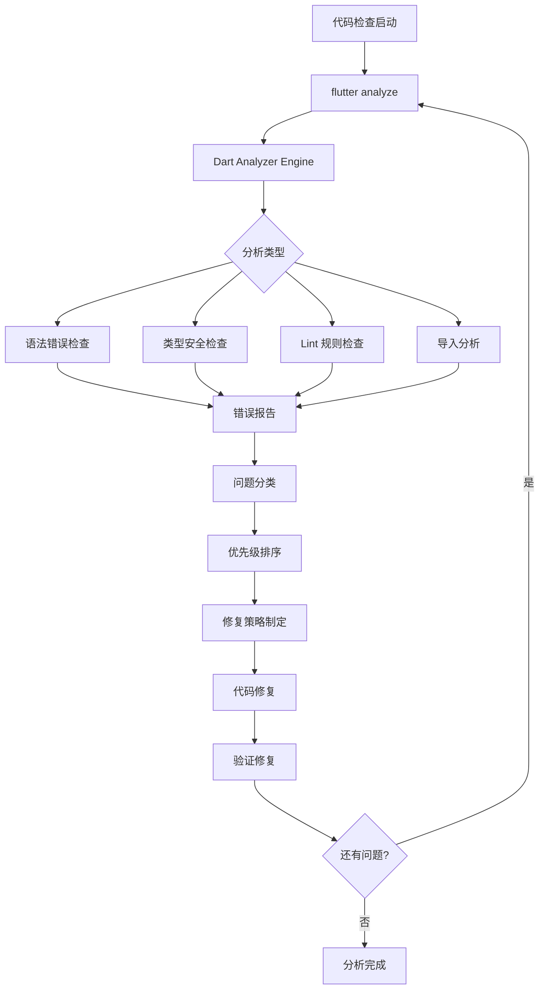
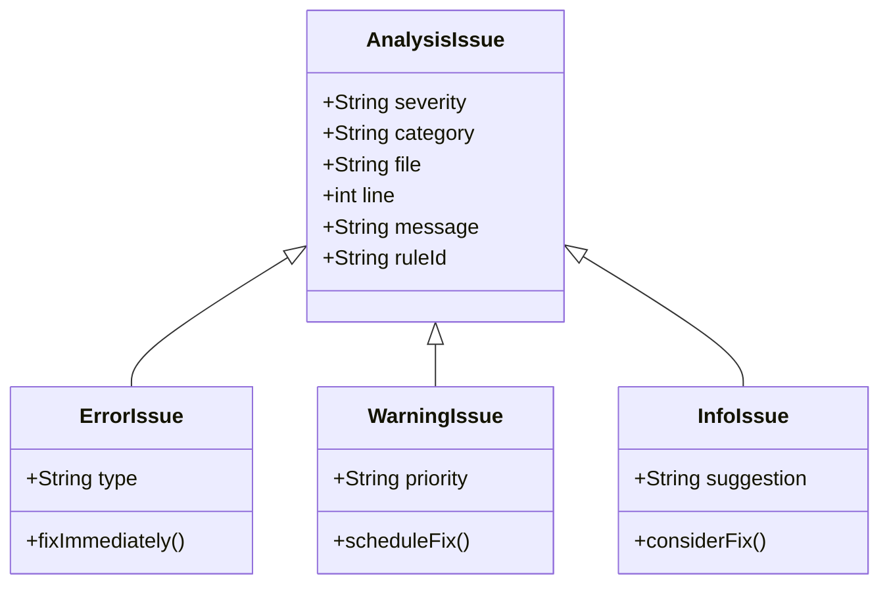
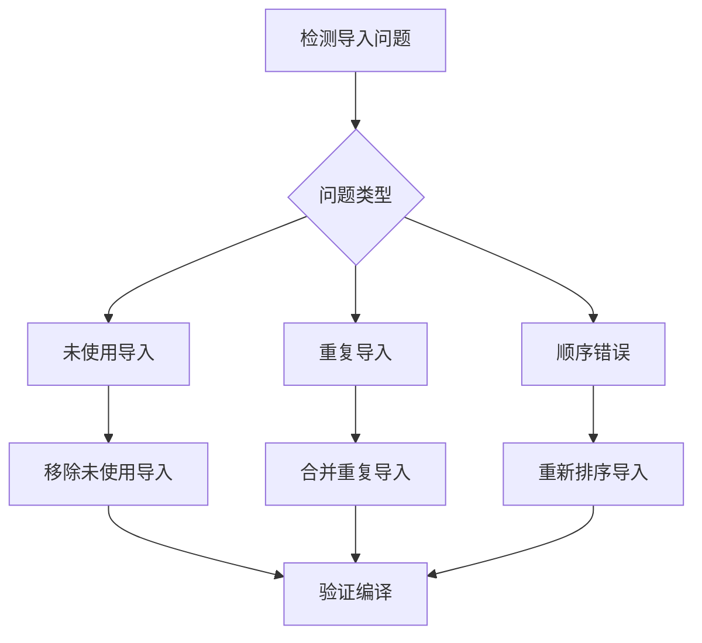

# 使用 Flutter Analyze 解决代码问题

## 概述

本设计文档详细说明如何使用 `flutter analyze` 静态分析工具来识别、分析和修复当前 Flutter 订阅管理应用中的代码质量问题。通过系统化的静态分析流程，提升代码质量，确保最佳实践的遵循。

## 技术栈

### 分析工具链
- **Flutter Analyze**: Flutter 内置静态代码分析工具
- **Dart Analyzer**: Dart 语言静态分析引擎
- **Flutter Lints**: Flutter 官方推荐的 lint 规则集
- **Analysis Options**: 自定义分析配置文件

### 项目技术栈
- **Framework**: Flutter 3.x
- **Language**: Dart 3.x
- **State Management**: Riverpod
- **Database**: Drift + SQLite
- **Cache**: Hive
- **Backend**: Supabase

## 架构设计

### 静态分析流程架构



### 问题分类体系



## 当前项目分析配置

### Analysis Options 配置

```yaml
# analysis_options.yaml 当前配置
include: package:flutter_lints/flutter.yaml

linter:
  rules:
    # 当前默认规则集
    # 可扩展的自定义规则配置
```

### 推荐的增强配置

```yaml
include: package:flutter_lints/flutter.yaml

analyzer:
  exclude:
    - "**/*.g.dart"
    - "**/*.freezed.dart"
    - build/**
  strong-mode:
    implicit-casts: false
    implicit-dynamic: false

linter:
  rules:
    # 代码风格
    prefer_single_quotes: true
    always_declare_return_types: true
    require_trailing_commas: true
    
    # 性能优化
    avoid_unnecessary_containers: true
    sized_box_for_whitespace: true
    
    # 代码质量
    avoid_print: true
    prefer_const_constructors: true
    prefer_const_literals_to_create_immutables: true
    
    # 导入管理
    directives_ordering: true
    unnecessary_import: true
```

## 常见问题类型与解决方案

### 1. 导入问题

#### 问题识别
- 未使用的导入
- 重复导入
- 导入顺序不规范

#### 解决策略


### 2. 类型安全问题

#### 常见问题
- 隐式类型转换
- 空安全违规
- 类型注解缺失

#### 修复方案
```dart
// 问题示例
var result = map['key']; // 隐式 dynamic

// 修复方案
String? result = map['key'] as String?;
```

### 3. 代码风格问题

#### Lint 规则违规
- 单引号 vs 双引号
- const 构造函数使用
- 尾随逗号

#### 自动化修复
```bash
# 格式化代码
flutter format .

# 应用可自动修复的 lint 建议
dart fix --apply
```

### 4. 性能相关问题

#### 识别模式
- 不必要的 Widget 重建
- 低效的布局结构
- 资源泄漏风险

#### 优化建议
```dart
// 问题：不必要的 Container
Container(
  child: Text('Hello'),
)

// 修复：直接使用 Widget
Text('Hello')
```

## 分析执行流程

### 1. 基础分析

```bash
# 执行完整项目分析
flutter analyze

# 分析特定目录
flutter analyze lib/

# 详细输出模式
flutter analyze --verbose
```

### 2. 问题过滤与分类


### 3. 修复策略

#### 优先级修复顺序
1. **Critical**: 编译错误、运行时异常风险
2. **High**: 性能问题、安全问题
3. **Medium**: 代码风格、可维护性
4. **Low**: 文档、注释改进

### 4. 自动化修复流程

```bash
# 1. 检查当前问题
flutter analyze > analysis_report.txt

# 2. 应用自动修复
dart fix --apply

# 3. 格式化代码
flutter format .

# 4. 重新验证
flutter analyze
```

## 特定文件类型的分析重点

### Model 文件 (*.dart)
- Freezed 生成代码排除
- 序列化方法完整性
- 空安全实现

### Provider 文件
- Riverpod 注解正确性
- 状态管理模式
- 内存泄漏检查

### UI Widget 文件
- Widget 生命周期
- 性能优化机会
- 可访问性支持

### Repository 文件
- 异常处理完整性
- 异步操作安全性
- 接口契约遵循

## 持续集成整合

### CI/CD 流程集成

```yaml
# .github/workflows/analyze.yml
name: Code Analysis
on: [push, pull_request]

jobs:
  analyze:


