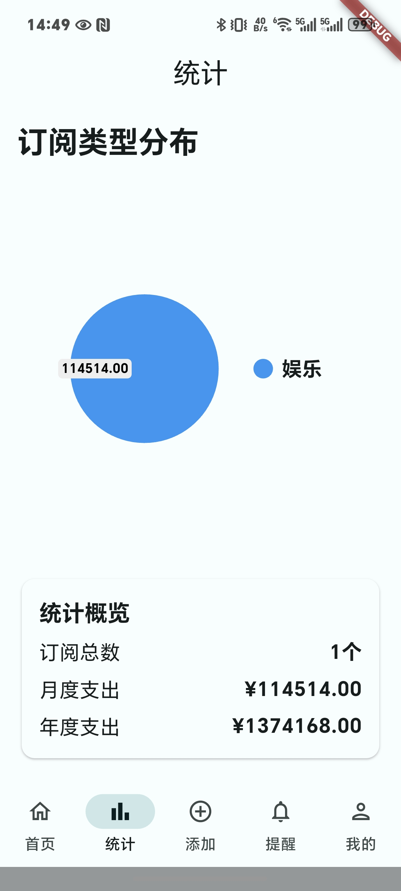

# Subscription Manager 订阅管理器

[English Version](#english) | [中文版本](#中文)

<span id="english"></span>
## English

Subscription Manager is a cross-platform mobile application built with Flutter that helps users track and manage their subscriptions efficiently. The app allows users to add, edit, and monitor their various subscriptions in one place, with features like notifications, statistics, and a clean Material Design 3 interface.

### Features

- **Subscription Management**: Add, edit, and delete subscriptions with details like name, price, billing cycle, renewal date, and more.
- **Multi-currency Support**: Handle subscriptions in different currencies (CNY, USD, EUR, GBP, etc.).
- **Smart Notifications**: Get notified about upcoming subscription renewals to avoid missing payments.
- **Statistics & Analytics**: Visualize your subscription spending with charts and detailed statistics.
- **Material Design 3**: Modern, clean interface with dynamic color support and dark mode.
- **Data Persistence**: All data is saved locally using shared_preferences.
- **Customizable Themes**: Choose from dynamic system colors or custom color schemes.
- **Responsive Design**: Works seamlessly on various screen sizes and orientations.

### Screenshots

| Home Screen | Statistics | Notifications | Add Subscription |
|-------------|------------|---------------|------------------|
|  |  |  |  |

### Tech Stack

- Flutter SDK
- Provider for state management
- shared_preferences for local data storage
- dynamic_color for Material Design 3 theming
- uuid for unique ID generation
- pie_chart for data visualization

### Getting Started

1. Make sure you have Flutter installed. If not, follow the [official installation guide](https://flutter.dev/docs/get-started/install).

2. Clone this repository:
   ```bash
   git clone https://github.com/your-username/subscription-manager.git
   ```

3. Navigate to the project directory:
   ```bash
   cd subscription-manager
   ```

4. Install dependencies:
   ```bash
   flutter pub get
   ```

5. Run the app:
   ```bash
   flutter run
   ```

### Project Structure

```
lib/
├── main.dart                 # Entry point of the application
├── home_screen.dart          # Main dashboard showing all subscriptions
├── statistics_screen.dart    # Charts and statistics about subscriptions
├── notifications_screen.dart # Upcoming subscription renewals
├── profile_screen.dart       # User settings and preferences
├── add_subscription_dialog.dart # Dialog for adding new subscriptions
├── edit_subscription_dialog.dart # Dialog for editing existing subscriptions
├── subscription.dart         # Subscription data model
├── subscription_provider.dart # State management for subscriptions
├── add_button.dart           # Floating action button component
├── icon_picker.dart          # Icon selection component
└── monthly_history.dart      # Monthly subscription history
```

### Contributing

Contributions are welcome! Please feel free to submit a Pull Request.

1. Fork the repository
2. Create your feature branch (`git checkout -b feature/AmazingFeature`)
3. Commit your changes (`git commit -m 'Add some AmazingFeature'`)
4. Push to the branch (`git push origin feature/AmazingFeature`)
5. Open a Pull Request

### License

This project is licensed under the MIT License - see the [LICENSE](LICENSE) file for details.

---

<span id="中文"></span>
## 中文

订阅管理器是一个使用Flutter构建的跨平台移动应用，帮助用户高效地跟踪和管理订阅。该应用允许用户在一个地方添加、编辑和监控各种订阅，具有通知、统计和简洁的Material Design 3界面等功能。

### 功能特点

- **订阅管理**：添加、编辑和删除订阅，包括名称、价格、计费周期、续订日期等详细信息。
- **多货币支持**：处理不同货币的订阅（人民币、美元、欧元、英镑等）。
- **智能通知**：获取即将到来的订阅续订通知，避免错过付款。
- **统计数据**：通过图表和详细统计数据可视化您的订阅支出。
- **Material Design 3**：具有动态颜色支持和深色模式的现代、简洁界面。
- **数据持久化**：所有数据都使用shared_preferences本地保存。
- **可定制主题**：从动态系统颜色或自定义配色方案中选择。
- **响应式设计**：在各种屏幕尺寸和方向上无缝工作。

### 应用截图

| 主页 | 统计数据 | 通知 | 添加订阅 |
|------|----------|------|----------|
|  |  |  |  |

### 技术栈

- Flutter SDK
- Provider 状态管理
- shared_preferences 本地数据存储
- dynamic_color Material Design 3 主题
- uuid 唯一ID生成
- pie_chart 数据可视化

### 开始使用

1. 确保您已安装Flutter。如果没有，请按照[官方安装指南](https://flutter.dev/docs/get-started/install)操作。

2. 克隆此仓库：
   ```bash
   git clone https://github.com/your-username/subscription-manager.git
   ```

3. 进入项目目录：
   ```bash
   cd subscription-manager
   ```

4. 安装依赖：
   ```bash
   flutter pub get
   ```

5. 运行应用：
   ```bash
   flutter run
   ```

### 项目结构

```
lib/
├── main.dart                 # 应用程序入口点
├── home_screen.dart          # 显示所有订阅的主仪表板
├── statistics_screen.dart    # 订阅图表和统计数据
├── notifications_screen.dart # 即将到来的订阅续订
├── profile_screen.dart       # 用户设置和偏好
├── add_subscription_dialog.dart # 添加新订阅的对话框
├── edit_subscription_dialog.dart # 编辑现有订阅的对话框
├── subscription.dart         # 订阅数据模型
├── subscription_provider.dart # 订阅状态管理
├── add_button.dart           # 浮动操作按钮组件
├── icon_picker.dart          # 图标选择组件
└── monthly_history.dart      # 月度订阅历史
```

### 贡献

欢迎贡献！请随时提交Pull Request。

1. Fork 此仓库
2. 创建您的功能分支 (`git checkout -b feature/AmazingFeature`)
3. 提交您的更改 (`git commit -m 'Add some AmazingFeature'`)
4. 推送到分支 (`git push origin feature/AmazingFeature`)
5. 打开 Pull Request

### 许可证

该项目采用MIT许可证 - 详情请见[LICENSE](LICENSE)文件。
