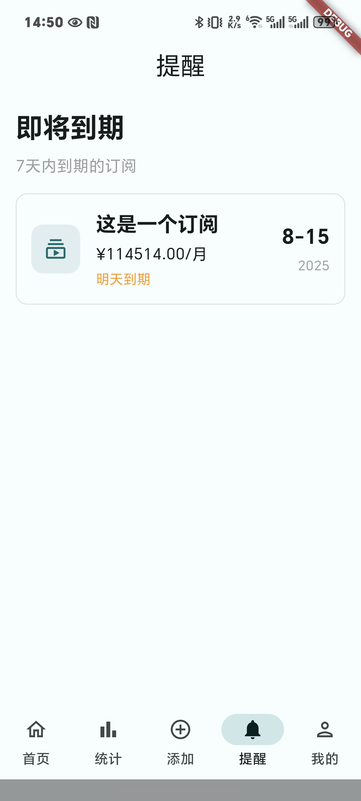

# Subscription Manager 订阅管理器

Please select your preferred language:
请选择您的语言：

- [English Version](README_en.md)
- [中文版本](README_zh.md)

<span id="english"></span>
## English

Subscription Manager is a cross-platform mobile application built with Flutter that helps users track and manage their subscriptions efficiently. The app allows users to add, edit, and monitor their various subscriptions in one place, with features like notifications, statistics, and a clean Material Design 3 interface.

### Features

- **Subscription Management**: Add, edit, and delete subscriptions with details like name, price, billing cycle, renewal date, and more.
- **Multi-currency Support**: Handle subscriptions in different currencies (CNY, USD, EUR, GBP, etc.) with fixed exchange rate support.
- **Smart Notifications**: Get notified about upcoming subscription renewals to avoid missing payments.
- **Statistics & Analytics**: Visualize your subscription spending with charts and detailed statistics.
- **Material Design 3**: Modern, clean interface with dynamic color support and dark mode.
- **Advanced Data Persistence**: Local SQLite database with Drift ORM and Hive caching for optimal performance.
- **Cloud Sync**: Supabase integration for cross-device synchronization and backup.
- **Offline Support**: Full offline functionality with automatic sync when connectivity is restored.
- **Customizable Themes**: Choose from dynamic system colors or custom color schemes.
- **Responsive Design**: Works seamlessly on various screen sizes and orientations.
- **Multi-platform Support**: Android, iOS, Web, Windows, macOS, and Linux.

### Screenshots

| Home Screen | Statistics | Notifications | Add Subscription |
|-------------|------------|---------------|------------------|
|  |  |  |  |

### Tech Stack

- **Flutter SDK** with Dart 3.0+
- **Riverpod** for modern state management
- **Drift (SQLite)** for local database with ORM support
- **Hive** for fast local caching
- **Supabase** for cloud synchronization and authentication
- **Dio + Retrofit** for REST API client with interceptors
- **GraphQL** for efficient data querying
- **Freezed** for immutable data classes and pattern matching
- **Dynamic Color** for Material Design 3 theming
- **Connectivity Plus** for network status monitoring
- **Pie Chart** for data visualization

### Getting Started

#### Prerequisites

- Flutter SDK 3.0 or higher
- Dart 3.0 or higher
- Supabase account for cloud sync (optional)

#### Environment Setup

1. **Clone the repository**
   ```bash
   git clone https://github.com/your-username/subscription-manager.git
   cd subscription-manager
   ```

2. **Copy environment file**
   ```bash
   cp .env.example .env
   ```

3. **Configure environment variables**
   Edit `.env` file with your Supabase credentials:
   ```
   SUPABASE_URL=your_supabase_url
   SUPABASE_ANON_KEY=your_supabase_anon_key
   ```

4. **Install dependencies**
   ```bash
   flutter pub get
   ```

5. **Generate code**
   ```bash
   flutter pub run build_runner build --delete-conflicting-outputs
   ```

6. **Run the application**
   ```bash
   flutter run
   ```

#### Build for Production

```bash
# Android
flutter build apk --release
flutter build appbundle --release

# iOS
flutter build ios --release

# Web
flutter build web --release

# Windows
flutter build windows --release

# macOS
flutter build macos --release

# Linux
flutter build linux --release
```

### Project Structure

```
lib/
├── main.dart                 # Application entry point
├── screens/                  # UI screens
│   ├── home_screen.dart      # Main dashboard
│   ├── statistics_screen.dart # Charts and analytics
│   ├── notifications_screen.dart # Renewal notifications
│   ├── profile_screen.dart   # User settings
│   └── auth_screen.dart      # Authentication
├── providers/                # Riverpod state management
│   ├── app_providers.dart    # Main providers
│   └── subscription_notifier.dart # Subscription state
├── models/                   # Data models (Freezed)
│   ├── subscription.dart     # Subscription model
│   ├── user_profile.dart     # User profile
│   └── sync_state.dart       # Sync status
├── services/                 # Business logic services
│   ├── sync_service.dart     # Cloud synchronization
│   ├── auth_service.dart     # Authentication
│   └── connectivity_service.dart # Network monitoring
├── repositories/             # Data access layer
│   ├── hybrid_subscription_repository.dart # Local + remote data
│   └── repository_interfaces.dart # Abstract interfaces
├── database/                 # Local database (Drift/SQLite)
│   ├── app_database.dart     # Database definition
│   └── tables.dart          # Table schemas
├── cache/                    # Caching layer (Hive)
│   ├── hive_service.dart     # Hive operations
│   └── smart_cache_manager.dart # Cache strategy
├── network/                  # Network layer
│   ├── dio_client.dart       # HTTP client
│   ├── graphql_client.dart   # GraphQL client
│   └── interceptors/         # Request interceptors
├── config/                   # Configuration
│   ├── supabase_config.dart  # Supabase setup
│   └── theme_builder.dart    # Theme configuration
├── dialogs/                  # Modal dialogs
│   ├── subscription_form.dart # Subscription forms
│   └── base_subscription_dialog.dart # Base dialog
├── utils/                    # Utilities
│   ├── currency_constants.dart # Currency support
│   ├── icon_picker.dart      # Icon selection
│   └── app_logger.dart       # Logging
└── widgets/                  # Reusable components
    ├── subscription_card.dart # Subscription item
    ├── sync_indicator.dart   # Sync status indicator
    └── statistics_card.dart  # Stats cards
```

### Architecture Overview

This application follows a clean architecture pattern with clear separation of concerns:

1. **Presentation Layer**: UI screens and widgets using Riverpod for state management
2. **Domain Layer**: Business logic services and use cases
3. **Data Layer**: Repositories implementing local (SQLite) and remote (Supabase) data sources
4. **Infrastructure Layer**: Network clients, database, and caching systems

#### Key Architectural Features:

- **Hybrid Data Strategy**: Local-first approach with cloud synchronization
- **Dependency Injection**: Riverpod providers for loose coupling
- **Error Handling**: Comprehensive error handling throughout all layers
- **Offline Support**: Full functionality without internet connection
- **Conflict Resolution**: Automatic conflict resolution during sync

### Contributing

Contributions are welcome! Please feel free to submit a Pull Request.

#### Development Setup

1. Fork the repository
2. Create your feature branch (`git checkout -b feature/AmazingFeature`)
3. Install dependencies and generate code:
   ```bash
   flutter pub get
   flutter pub run build_runner build --delete-conflicting-outputs
   ```
4. Commit your changes (`git commit -m 'Add some AmazingFeature'`)
5. Push to the branch (`git push origin feature/AmazingFeature`)
6. Open a Pull Request

#### Code Generation

This project uses several code generation tools:
- `build_runner` for Freezed, JSON serialization, and Riverpod codegen
- `drift_dev` for database code generation
- `retrofit_generator` for API client generation

Always run code generation after modifying:
- Data models (`@freezed` classes)
- Database tables
- API clients
- Riverpod providers

---

<span id="中文"></span>
## 中文

订阅管理器是一个使用Flutter构建的跨平台移动应用，帮助用户高效地跟踪和管理订阅。该应用允许用户在一个地方添加、编辑和监控各种订阅，具有通知、统计和简洁的Material Design 3界面等功能。

### 功能特点

- **订阅管理**：添加、编辑和删除订阅，包括名称、价格、计费周期、续订日期等详细信息。
- **多货币支持**：处理不同货币的订阅（人民币、美元、欧元、英镑等）并支持固定汇率。
- **智能通知**：获取即将到来的订阅续订通知，避免错过付款。
- **统计数据**：通过图表和详细统计数据可视化您的订阅支出。
- **Material Design 3**：具有动态颜色支持和深色模式的现代、简洁界面。
- **高级数据持久化**：使用Drift ORM的本地SQLite数据库和Hive缓存，实现最佳性能。
- **云同步**：Supabase集成，支持跨设备同步和备份。
- **离线支持**：完整的离线功能，连接恢复时自动同步。
- **可定制主题**：从动态系统颜色或自定义配色方案中选择。
- **响应式设计**：在各种屏幕尺寸和方向上无缝工作。
- **多平台支持**：Android、iOS、Web、Windows、macOS和Linux。

### 应用截图

| 主页 | 统计数据 | 通知 | 添加订阅 |
|------|----------|------|----------|
|  |  |  |  |

### 技术栈

- **Flutter SDK** 和 Dart 3.0+
- **Riverpod** 现代化状态管理
- **Drift (SQLite)** 带ORM支持的本地数据库
- **Hive** 快速本地缓存
- **Supabase** 云同步和认证
- **Dio + Retrofit** 带拦截器的REST API客户端
- **GraphQL** 高效数据查询
- **Freezed** 不可变数据类和模式匹配
- **Dynamic Color** Material Design 3主题
- **Connectivity Plus** 网络状态监控
- **Pie Chart** 数据可视化

### 开始使用

#### 环境要求

- Flutter SDK 3.0 或更高版本
- Dart 3.0 或更高版本
- Supabase 账户用于云同步（可选）

#### 环境设置

1. **克隆仓库**
   ```bash
   git clone https://github.com/your-username/subscription-manager.git
   cd subscription-manager
   ```

2. **复制环境文件**
   ```bash
   cp .env.example .env
   ```

3. **配置环境变量**
   编辑 `.env` 文件，填入您的 Supabase 凭据：
   ```
   SUPABASE_URL=your_supabase_url
   SUPABASE_ANON_KEY=your_supabase_anon_key
   ```

4. **安装依赖**
   ```bash
   flutter pub get
   ```

5. **生成代码**
   ```bash
   flutter pub run build_runner build --delete-conflicting-outputs
   ```

6. **运行应用**
   ```bash
   flutter run
   ```

#### 生产构建

```bash
# Android
flutter build apk --release
flutter build appbundle --release

# iOS
flutter build ios --release

# Web
flutter build web --release

# Windows
flutter build windows --release

# macOS
flutter build macos --release

# Linux
flutter build linux --release
```

### 项目结构

```
lib/
├── main.dart                 # 应用程序入口点
├── screens/                  # UI界面
│   ├── home_screen.dart      # 主仪表板
│   ├── statistics_screen.dart # 图表和统计数据
│   ├── notifications_screen.dart # 续订通知
│   ├── profile_screen.dart   # 用户设置
│   └── auth_screen.dart      # 认证界面
├── providers/                # Riverpod状态管理
│   ├── app_providers.dart    # 主要Provider
│   └── subscription_notifier.dart # 订阅状态
├── models/                   # 数据模型 (Freezed)
│   ├── subscription.dart     # 订阅模型
│   ├── user_profile.dart     # 用户资料
│   └── sync_state.dart       # 同步状态
├── services/                 # 业务逻辑服务
│   ├── sync_service.dart     # 云同步服务
│   ├── auth_service.dart     # 认证服务
│   └── connectivity_service.dart # 网络监控服务
├── repositories/             # 数据访问层
│   ├── hybrid_subscription_repository.dart # 本地+远程数据
│   └── repository_interfaces.dart # 抽象接口
├── database/                 # 本地数据库 (Drift/SQLite)
│   ├── app_database.dart     # 数据库定义
│   └── tables.dart          # 表结构
├── cache/                    # 缓存层 (Hive)
│   ├── hive_service.dart     # Hive操作
│   └── smart_cache_manager.dart # 缓存策略
├── network/                  # 网络层
│   ├── dio_client.dart       # HTTP客户端
│   ├── graphql_client.dart   # GraphQL客户端
│   └── interceptors/         # 请求拦截器
├── config/                   # 配置
│   ├── supabase_config.dart  # Supabase配置
│   └── theme_builder.dart    # 主题配置
├── dialogs/                  # 模态对话框
│   ├── subscription_form.dart # 订阅表单
│   └── base_subscription_dialog.dart # 基础对话框
├── utils/                    # 工具类
│   ├── currency_constants.dart # 货币支持
│   ├── icon_picker.dart      # 图标选择
│   └── app_logger.dart       # 日志记录
└── widgets/                  # 可复用组件
    ├── subscription_card.dart # 订阅卡片
    ├── sync_indicator.dart   # 同步状态指示器
    └── statistics_card.dart  # 统计卡片
```

### 架构概览

Subscription Manager 采用**清洁架构**设计，分为四个主要层次：

#### 1. 表示层 (Presentation Layer)
- **UI组件**：Widgets、Screens、Dialogs
- **状态管理**：Riverpod Providers
- **主题和本地化**：Material Design 3 主题系统

#### 2. 领域层 (Domain Layer)
- **业务逻辑**：Services 目录中的核心业务逻辑
- **数据模型**：Freezed 不可变数据类
- **接口定义**：Repository 抽象接口

#### 3. 数据层 (Data Layer)
- **本地存储**：Drift ORM + SQLite 数据库
- **缓存策略**：Hive 快速本地缓存
- **远程数据**：Supabase + REST/GraphQL API

#### 4. 基础设施层 (Infrastructure Layer)
- **网络通信**：Dio + Retrofit + GraphQL
- **依赖注入**：Riverpod Provider 容器
- **工具和配置**：环境配置、日志记录、错误处理

#### 关键架构特性

- **混合数据策略**：本地优先，云端同步
- **依赖注入**：通过 Riverpod 实现松耦合
- **错误处理**：统一的错误处理机制
- **离线支持**：完整的离线功能
- **冲突解决**：智能数据同步和冲突解决

### 贡献

欢迎贡献！请随时提交Pull Request。

1. Fork 此仓库
2. 创建您的功能分支 (`git checkout -b feature/AmazingFeature`)
3. 提交您的更改 (`git commit -m 'Add some AmazingFeature'`)
4. 推送到分支 (`git push origin feature/AmazingFeature`)
5. 打开 Pull Request


