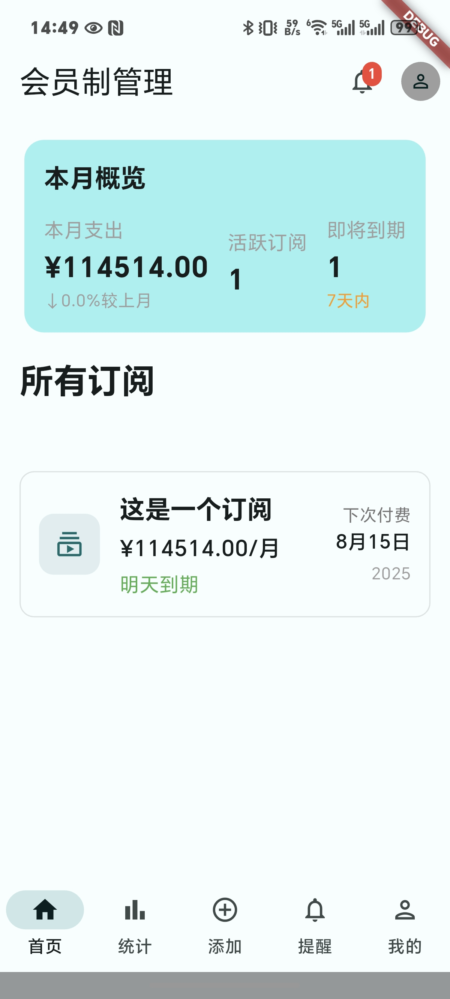

# Subscription Manager 订阅管理器

订阅管理器是一个使用Flutter构建的跨平台移动应用，帮助用户高效地跟踪和管理订阅。该应用允许用户在一个地方添加、编辑和监控各种订阅，具有通知、统计和简洁的Material Design 3界面等功能。

## 功能特点

### 核心订阅管理
- **订阅CRUD操作**：创建、读取、更新和删除订阅，包含完整验证
- **多货币支持**：使用固定汇率服务跟踪不同货币的订阅
- **订阅统计**：全面的支出分析，包含分类统计和趋势分析
- **搜索和筛选**：按名称、类别、价格和状态进行高级搜索和筛选
- **数据导出**：将订阅数据导出为CSV格式进行外部分析

### 用户体验与界面
- **Material Design 3**：具有动态主题和自适应系统颜色的现代UI
- **深色/浅色主题**：完整支持深色和浅色主题，支持自动系统检测
- **响应式设计**：针对各种屏幕尺寸和设备方向进行优化
- **HarmonyOS Sans字体**：自定义排版，提高可读性
- **无障碍访问**：符合WCAG 2.1标准的无障碍功能和屏幕阅读器支持

### 数据管理与同步
- **离线优先**：使用本地数据库实现无网络连接的完整功能
- **云同步**：与Supabase云后端的自动双向同步
- **冲突解决**：同步过程中的智能冲突检测和解决
- **数据迁移**：支持从旧格式进行模式迁移和数据转换
- **实时更新**：通过Supabase实时订阅实现实时数据更新
- **智能缓存**：具有可配置过期策略的多级缓存策略

### 认证与安全
- **用户认证**：使用Supabase Auth进行安全的注册、登录和注销
- **会话管理**：自动会话持久化和令牌刷新
- **数据隔离**：用户特定的数据隔离和隐私保护
- **安全存储**：敏感信息的加密本地存储

### 网络与性能
- **混合网络**：REST API (Dio + Retrofit) 和 GraphQL 集成
- **网络监控**：全面的网络状态和性能监控
- **请求拦截器**：认证、日志记录、错误处理、重试和监控拦截器
- **连接管理**：自动处理网络连接变化
- **性能优化**：优化的数据加载和渲染性能

### 高级功能
- **通知系统**：订阅续订前的可配置提醒
- **预算跟踪**：支出限制和预算监控功能
- **分类管理**：带有颜色编码的自定义订阅类别
- **支付跟踪**：支付历史和即将到来的支付计划
- **收据管理**：支持附加和存储订阅收据
- **订阅分析**：带有图表和可视化的高级分析
- **备份与恢复**：数据备份和恢复功能
- **多语言支持**：国际化与本地化基础设施（计划中）

### 开发者体验
- **代码生成**：广泛使用代码生成减少样板代码
- **类型安全**：Dart强类型系统的完整类型安全
- **测试基础设施**：包含单元测试、部件测试和集成测试的全面测试套件
- **调试工具**：增强的调试功能，包含日志记录和错误报告
- **热重载**：Flutter热重载功能的快速开发周期
- **代码混淆**：通过Dart代码混淆增强发布版本的安全性

### 应用截图

| 主页 | 统计数据 | 通知 | 添加订阅 |
|------|----------|------|----------|
|  |  |  |  |

### 技术栈

#### 核心框架
- **Flutter SDK 3.0+** - 跨平台UI框架
- **Dart 3.0+** - 强类型编程语言

#### 状态管理
- **Riverpod 2.0+** - 现代化状态管理和依赖注入
- **Flutter Bloc** - 业务逻辑组件模式（用于功能模块）

#### 数据持久化
- **Drift (Moor)** - 类型安全的SQLite ORM，支持代码生成
- **Hive 2.0+** - 快速键值对本地缓存
- **Shared Preferences** - 简单的键值对存储

#### 云服务与后端
- **Supabase Flutter** - 完整的后端即服务（认证、数据库、存储）
- **Dio 5.0+** - 强大的HTTP客户端
- **Retrofit** - 类型安全的REST API客户端生成器
- **GraphQL Flutter** - GraphQL客户端集成

#### 数据建模与序列化
- **Freezed** - 不可变数据类和模式匹配
- **JSON Annotation** - JSON序列化注解
- **Freezed Annotation** - Freezed代码生成支持

#### UI与主题
- **Dynamic Color** - Material Design 3动态主题支持
- **Pie Chart** - 数据可视化图表库
- **HarmonyOS Sans** - 自定义字体集成

#### 网络与连接
- **Connectivity Plus** - 网络连接状态监控
- **Internet Connection Checker** - 互联网连接检查

#### 工具与实用程序
- **Logger** - 结构化日志记录
- **UUID** - 唯一标识符生成
- **Flutter Dotenv** - 环境变量管理
- **Flutter Launcher Icons** - 应用图标生成

#### 代码生成（开发依赖）
- **Build Runner** - Dart构建系统
- **Riverpod Generator** - Riverpod提供者代码生成
- **Freezed Generator** - Freezed数据类代码生成
- **JSON Serializable** - JSON序列化代码生成
- **Drift Dev** - Drift数据库代码生成
- **Hive Generator** - Hive适配器代码生成
- **Retrofit Generator** - Retrofit客户端代码生成
- **GraphQL Code Builder** - GraphQL代码生成

### 开始使用

#### 环境要求

- Flutter SDK 3.0 或更高版本
- Dart 3.0 或更高版本
- Supabase 账户用于云同步（可选）

#### 环境设置

1. **克隆仓库**
   ```bash
   git clone https://github.com/your-username/subscription-manager.git
   cd subscription-manager
   ```

2. **复制环境文件**
   ```bash
   cp .env.example .env
   ```

3. **配置环境变量**
   编辑 `.env` 文件，填入您的 Supabase 凭据：
   ```
   SUPABASE_URL=your_supabase_url
   SUPABASE_ANON_KEY=your_supabase_anon_key
   ```

4. **安装依赖**
   ```bash
   flutter pub get
   ```

5. **生成代码**
   ```bash
   flutter pub run build_runner build --delete-conflicting-outputs
   ```

6. **运行应用**
   ```bash
   flutter run
   ```

#### 生产构建

```bash
# Android
flutter build apk --release
flutter build appbundle --release

# iOS
flutter build ios --release

# Web
flutter build web --release

# Windows
flutter build windows --release

# macOS
flutter build macos --release

# Linux
flutter build linux --release
```

#### 带代码混淆的构建

为了增强应用安全性，可以构建启用代码混淆的版本：

```bash
# Android带混淆
flutter build apk --obfuscate --split-debug-info=./build/symbols
flutter build appbundle --obfuscate --split-debug-info=./build/symbols

# iOS带混淆
flutter build ios --obfuscate --split-debug-info=./build/symbols

# 其他平台带混淆
flutter build ipa --obfuscate --split-debug-info=./build/symbols
flutter build windows --obfuscate --split-debug-info=./build/symbols
```

为方便使用，您也可以使用提供的构建脚本：
- Windows: `scripts\build-obfuscated.bat`
- macOS/Linux: `scripts/build-obfuscated.sh`

用于调试混淆构建的符号文件存储在 `./build/symbols` 目录中。请备份这些文件以备将来调试使用。

### 项目结构

```
lib/
├── main.dart                          # 应用程序入口点
├── fixed_exchange_rate_service.dart   # 固定汇率服务
├── screens/                           # UI界面
│   ├── home_screen.dart               # 主仪表板
│   ├── profile_screen.dart            # 用户设置
│   └── subscription_main_screen.dart  # 订阅主界面
├── providers/                         # Riverpod状态管理
│   └── app_providers.dart             # 主要Provider配置
├── models/                            # 数据模型 (Freezed)
│   └── *.dart                         # 各种数据模型
├── services/                          # 业务逻辑服务
│   ├── auth_service.dart              # 认证服务
│   ├── migration_service.dart         # 数据迁移服务
│   ├── network_monitor_service.dart   # 网络监控服务
│   ├── smart_cache_manager.dart       # 智能缓存管理
│   └── sync_service.dart              # 同步服务
├── repositories/                      # 数据访问层
│   ├── enhanced_remote_subscription_repository.dart # 增强远程订阅仓库
│   └── subscription_repository_impl.dart            # 订阅仓库实现
├── database/                          # 本地数据库 (Drift/SQLite)
│   ├── app_database.dart              # 数据库定义
│   └── *.g.dart                       # 生成的数据库代码
├── cache/                             # 缓存层 (Hive)
│   └── *.dart                         # 缓存相关实现
├── network/                           # 网络层
│   ├── api/                           # API客户端
│   │   └── *.dart                     # API接口定义
│   ├── dto/                           # 数据传输对象
│   │   └── *.dart                     # DTO定义
│   ├── graphql/                       # GraphQL相关
│   │   └── *.dart                     # GraphQL查询和变更
│   ├── interceptors/                  # 请求拦截器
│   │   └── *.dart                     # 各种拦截器实现
│   ├── monitoring/                    # 网络监控
│   │   └── *.dart                     # 监控相关代码
│   └── error/                         # 错误处理
│       └── *.dart                     # 错误类和处理器
├── config/                            # 配置
│   └── *.dart                         # 各种配置文件
├── dialogs/                           # 模态对话框
│   └── *.dart                         # 对话框组件
├── utils/                             # 工具类
│   └── *.dart                         # 各种工具函数
├── widgets/                           # 可复用组件
│   └── *.dart                         # 各种UI组件
├── constants/                         # 常量定义
│   └── *.dart                         # 应用常量
├── core/                              # 核心架构层
│   ├── data/                          # 数据层实现
│   │   └── *.dart                     # 数据源和仓库
│   ├── domain/                        # 领域层
│   │   └── *.dart                     # 业务逻辑和实体
│   └── presentation/                  # 表示层
│       └── *.dart                     # UI和状态管理
└── features/                          # 功能模块
    ├── subscription_feature/          # 订阅功能模块
    │   ├── bloc/                      # BLoC状态管理
    │   │   └── subscription_bloc.dart # 订阅BLoC
    │   └── *.dart                     # 订阅相关文件
    └── user_profile_feature/          # 用户资料功能模块
        └── *.dart                     # 用户资料相关文件
```

### 架构概览

Subscription Manager 采用 **清洁架构（Clean Architecture）** 设计，具有以下分层结构：

#### 1. 表示层（Presentation Layer）
- **UI组件和界面逻辑**：使用Flutter Widget构建用户界面
- **状态管理**：混合使用Riverpod（应用级状态）和Flutter Bloc（功能模块状态）
- **用户交互处理**：事件驱动架构处理用户输入
- **主题和样式**：Material Design 3动态主题支持

#### 2. 领域层（Domain Layer）
- **业务逻辑和用例**：封装核心业务规则和用例实现
- **实体定义**：使用Freezed创建不可变数据类
- **仓库接口抽象**：定义数据访问的抽象接口
- **领域服务**：跨实体的业务逻辑封装

#### 3. 数据层（Data Layer）
- **仓库实现**：实现领域层的抽象接口
- **本地数据源**：Drift（SQLite）数据库 + Hive缓存
- **远程数据源**：Supabase实时数据库 + REST API + GraphQL
- **数据映射和转换**：DTO到实体对象的转换
- **数据迁移服务**：支持从SharedPreferences到Drift的平滑迁移

#### 4. 基础设施层（Infrastructure Layer）
- **外部服务集成**：Supabase认证、数据库、存储服务
- **网络通信**：Dio + Retrofit（REST） + GraphQL客户端
- **本地存储**：Drift数据库、Hive缓存、SharedPreferences
- **网络监控**：连接状态检测和请求性能监控
- **错误处理**：统一的错误处理机制

#### 关键架构特性

- **功能优先模块化**：按功能（订阅、用户资料）组织代码结构，提高可维护性和可测试性
- **混合数据策略**：本地优先策略，支持离线使用，云同步备份确保数据一致性
- **智能缓存管理**：多层缓存策略（内存、Hive、数据库）优化性能和数据访问
- **实时数据同步**：Supabase实时订阅实现多设备即时数据同步
- **类型安全**：全面使用代码生成确保类型安全（Drift、Freezed、Retrofit）
- **错误恢复**：健壮的错误处理和重试机制
- **性能监控**：网络请求监控和性能统计
- **安全认证**：Supabase提供的安全认证和授权机制

#### 架构优势

- **可测试性**：清晰的层级分离便于单元测试和集成测试
- **可维护性**：功能模块化使代码更易于理解和维护
- **可扩展性**：抽象接口设计支持轻松添加新的数据源或功能
- **性能优化**：智能缓存和离线优先策略提供流畅的用户体验
- **跨平台一致性**：Flutter框架确保iOS和Android平台的一致性

### 贡献

欢迎贡献！请随时提交Pull Request。

1. Fork 此仓库
2. 创建您的功能分支 (`git checkout -b feature/AmazingFeature`)
3. 提交您的更改 (`git commit -m 'Add some AmazingFeature'`)
4. 推送到分支 (`git push origin feature/AmazingFeature`)
5. 打开 Pull Request