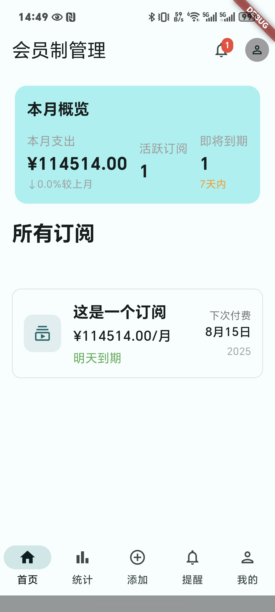
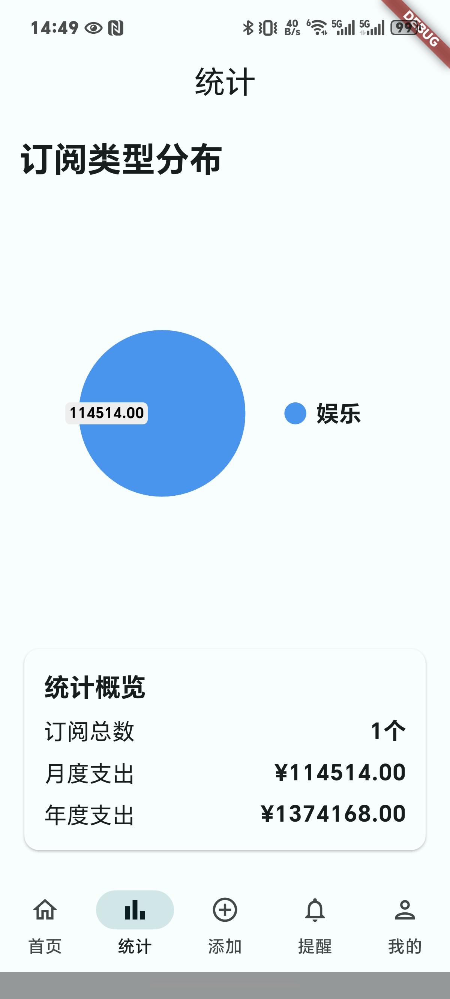
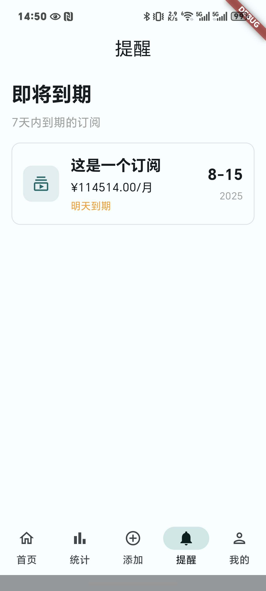
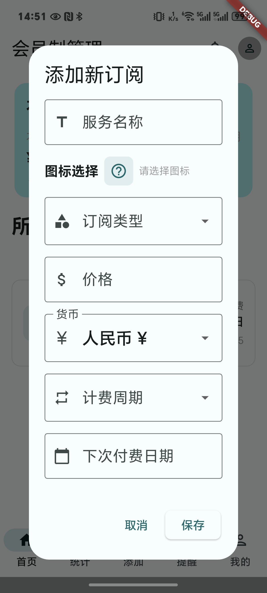

# Subscription Manager

Subscription Manager is a cross-platform mobile application built with Flutter that helps users track and manage their subscriptions efficiently. The app allows users to add, edit, and monitor their various subscriptions in one place, with features like notifications, statistics, and a clean Material Design 3 interface.

## Features

- **Subscription Management**: Add, edit, and delete subscriptions with details like name, price, billing cycle, renewal date, and more.
- **Multi-currency Support**: Handle subscriptions in different currencies (CNY, USD, EUR, GBP, etc.).
- **Smart Notifications**: Get notified about upcoming subscription renewals to avoid missing payments.
- **Statistics & Analytics**: Visualize your subscription spending with charts and detailed statistics.
- **Material Design 3**: Modern, clean interface with dynamic color support and dark mode.
- **Data Persistence**: All data is saved locally using shared_preferences.
- **Customizable Themes**: Choose from dynamic system colors or custom color schemes.
- **Responsive Design**: Works seamlessly on various screen sizes and orientations.

## Screenshots

| Home Screen | Statistics | Notifications | Add Subscription |
|-------------|------------|---------------|------------------|
|  |  |  |  |

## Tech Stack

- Flutter SDK
- Provider for state management
- shared_preferences for local data storage
- dynamic_color for Material Design 3 theming
- uuid for unique ID generation
- pie_chart for data visualization

## Getting Started

1. Make sure you have Flutter installed. If not, follow the [official installation guide](https://flutter.dev/docs/get-started/install).

2. Clone this repository:
   ```bash
   git clone https://github.com/your-username/subscription-manager.git
   ```

3. Navigate to the project directory:
   ```bash
   cd subscription-manager
   ```

4. Install dependencies:
   ```bash
   flutter pub get
   ```

5. Run the app:
   ```bash
   flutter run
   ```

## Project Structure

```
lib/
├── main.dart                 # Entry point of the application
├── home_screen.dart          # Main dashboard showing all subscriptions
├── statistics_screen.dart    # Charts and statistics about subscriptions
├── notifications_screen.dart # Upcoming subscription renewals
├── profile_screen.dart       # User settings and preferences
├── add_subscription_dialog.dart # Dialog for adding new subscriptions
├── edit_subscription_dialog.dart # Dialog for editing existing subscriptions
├── subscription.dart         # Subscription data model
├── subscription_provider.dart # State management for subscriptions
├── add_button.dart           # Floating action button component
├── icon_picker.dart          # Icon selection component
└── monthly_history.dart      # Monthly subscription history
```

## Contributing

Contributions are welcome! Please feel free to submit a Pull Request.

1. Fork the repository
2. Create your feature branch (`git checkout -b feature/AmazingFeature`)
3. Commit your changes (`git commit -m 'Add some AmazingFeature'`)
4. Push to the branch (`git push origin feature/AmazingFeature`)
5. Open a Pull Request

## License

This project is licensed under the MIT License - see the [LICENSE](LICENSE) file for details.