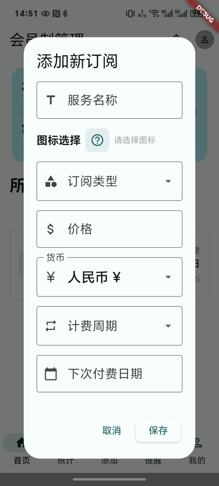

# 订阅管理器

订阅管理器是一个使用Flutter构建的跨平台移动应用，帮助用户高效地跟踪和管理订阅。该应用允许用户在一个地方添加、编辑和监控各种订阅，具有通知、统计和简洁的Material Design 3界面等功能。

## 功能特点

- **订阅管理**：添加、编辑和删除订阅，包括名称、价格、计费周期、续订日期等详细信息。
- **多货币支持**：处理不同货币的订阅（人民币、美元、欧元、英镑等）。
- **智能通知**：获取即将到来的订阅续订通知，避免错过付款。
- **统计数据**：通过图表和详细统计数据可视化您的订阅支出。
- **Material Design 3**：具有动态颜色支持和深色模式的现代、简洁界面。
- **数据持久化**：所有数据都使用shared_preferences本地保存。
- **可定制主题**：从动态系统颜色或自定义配色方案中选择。
- **响应式设计**：在各种屏幕尺寸和方向上无缝工作。

## 应用截图

| 主页 | 统计数据 | 通知 | 添加订阅 |
|------|----------|------|----------|
|  |  |  |  |

## 技术栈

- Flutter SDK
- Provider 状态管理
- shared_preferences 本地数据存储
- dynamic_color Material Design 3 主题
- uuid 唯一ID生成
- pie_chart 数据可视化

## 开始使用

1. 确保您已安装Flutter。如果没有，请按照[官方安装指南](https://flutter.dev/docs/get-started/install)操作。

2. 克隆此仓库：
   ```bash
   git clone https://github.com/your-username/subscription-manager.git
   ```

3. 进入项目目录：
   ```bash
   cd subscription-manager
   ```

4. 安装依赖：
   ```bash
   flutter pub get
   ```

5. 运行应用：
   ```bash
   flutter run
   ```

## 项目结构

```
lib/
├── main.dart                 # 应用程序入口点
├── home_screen.dart          # 显示所有订阅的主仪表板
├── statistics_screen.dart    # 订阅图表和统计数据
├── notifications_screen.dart # 即将到来的订阅续订
├── profile_screen.dart       # 用户设置和偏好
├── add_subscription_dialog.dart # 添加新订阅的对话框
├── edit_subscription_dialog.dart # 编辑现有订阅的对话框
├── subscription.dart         # 订阅数据模型
├── subscription_provider.dart # 订阅状态管理
├── add_button.dart           # 浮动操作按钮组件
├── icon_picker.dart          # 图标选择组件
└── monthly_history.dart      # 月度订阅历史
```

## 贡献

欢迎贡献！请随时提交Pull Request。

1. Fork 此仓库
2. 创建您的功能分支 (`git checkout -b feature/AmazingFeature`)
3. 提交您的更改 (`git commit -m 'Add some AmazingFeature'`)
4. 推送到分支 (`git push origin feature/AmazingFeature`)
5. 打开 Pull Request
